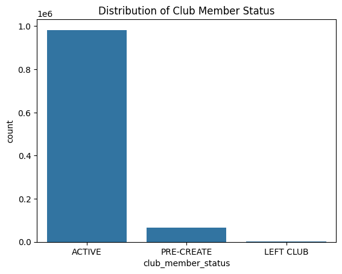

```python
import pandas as pd
import numpy as np

customer = pd.read_csv("customer_hm.csv")
print(customer.head())
print(customer.shape)
print(customer.info())
```

                                             customer_id  FN  Active  \
    0  00000dbacae5abe5e23885899a1fa44253a17956c6d1c3...   0       0   
    1  0000423b00ade91418cceaf3b26c6af3dd342b51fd051e...   0       0   
    2  000058a12d5b43e67d225668fa1f8d618c13dc232df0ca...   0       0   
    3  00005ca1c9ed5f5146b52ac8639a40ca9d57aeff4d1bd2...   0       0   
    4  00006413d8573cd20ed7128e53b7b13819fe5cfc2d801f...   1       1   
    
      club_member_status fashion_news_frequency  age  
    0             ACTIVE                   NONE   49  
    1             ACTIVE                   NONE   25  
    2             ACTIVE                   NONE   24  
    3             ACTIVE                   NONE   54  
    4             ACTIVE              Regularly   52  
    (1048575, 6)
    <class 'pandas.DataFrame'>
    RangeIndex: 1048575 entries, 0 to 1048574
    Data columns (total 6 columns):
     #   Column                  Non-Null Count    Dtype
    ---  ------                  --------------    -----
     0   customer_id             1048575 non-null  str  
     1   FN                      1048575 non-null  int64
     2   Active                  1048575 non-null  int64
     3   club_member_status      1048575 non-null  str  
     4   fashion_news_frequency  1048574 non-null  str  
     5   age                     1048575 non-null  int64
    dtypes: int64(3), str(3)
    memory usage: 48.0 MB
    None
    


```python
import pandas as pd
import numpy as np

transactions = pd.read_csv("transactions_hm.csv")
print(transactions.head())
print(transactions.shape)
print(transactions.info())
```

            t_dat                                        customer_id  article_id  \
    0  2019-11-05  3e2b60b679e62fb49516105b975560082922011dd752ec...   698328010   
    1  2019-05-22  89647ac2274f54c770aaa4b326e0eea09610c252381f37...   760597002   
    2  2019-05-10  2ebe392150feb60ca89caa8eff6c08b7ef1138cd6fdc71...   488561032   
    3  2019-08-26  7b3205de4ca17a339624eb5e3086698e9984eba6b47c56...   682771001   
    4  2019-08-10  3b77905de8b32045f08cedb79200cdfa477e9562429a39...   742400033   
    
          price  sales_channel_id  
    0  0.016932                 2  
    1  0.033881                 2  
    2  0.016932                 2  
    3  0.033881                 2  
    4  0.003220                 1  
    (1048575, 5)
    <class 'pandas.DataFrame'>
    RangeIndex: 1048575 entries, 0 to 1048574
    Data columns (total 5 columns):
     #   Column            Non-Null Count    Dtype  
    ---  ------            --------------    -----  
     0   t_dat             1048575 non-null  str    
     1   customer_id       1048575 non-null  str    
     2   article_id        1048575 non-null  int64  
     3   price             1048575 non-null  float64
     4   sales_channel_id  1048575 non-null  int64  
    dtypes: float64(1), int64(2), str(2)
    memory usage: 40.0 MB
    None
    


```python
import pandas as pd
import numpy as np

print(pd.__version__)
print("Hello h&m!")

articles = pd.read_csv("articles_hm.csv")
print(articles.head())
print(articles.shape)
print(articles.info())

#침침.... 일단 아이디가 좀 더럽고 (보안문제겠지)
#
```

    3.0.0
    Hello h&m!
       article_id  product_code          prod_name  product_type_no  \
    0   108775015        108775          Strap top              253   
    1   108775044        108775          Strap top              253   
    2   108775051        108775      Strap top (1)              253   
    3   110065001        110065  OP T-shirt (Idro)              306   
    4   110065002        110065  OP T-shirt (Idro)              306   
    
      product_type_name  product_group_name  graphical_appearance_no  \
    0          Vest top  Garment Upper body                  1010016   
    1          Vest top  Garment Upper body                  1010016   
    2          Vest top  Garment Upper body                  1010017   
    3               Bra           Underwear                  1010016   
    4               Bra           Underwear                  1010016   
    
      graphical_appearance_name  colour_group_code colour_group_name  ...  \
    0                     Solid                  9             Black  ...   
    1                     Solid                 10             White  ...   
    2                    Stripe                 11         Off White  ...   
    3                     Solid                  9             Black  ...   
    4                     Solid                 10             White  ...   
    
       department_name index_code        index_name index_group_no  \
    0     Jersey Basic          A        Ladieswear              1   
    1     Jersey Basic          A        Ladieswear              1   
    2     Jersey Basic          A        Ladieswear              1   
    3   Clean Lingerie          B  Lingeries/Tights              1   
    4   Clean Lingerie          B  Lingeries/Tights              1   
    
       index_group_name section_no            section_name garment_group_no  \
    0        Ladieswear         16  Womens Everyday Basics             1002   
    1        Ladieswear         16  Womens Everyday Basics             1002   
    2        Ladieswear         16  Womens Everyday Basics             1002   
    3        Ladieswear         61         Womens Lingerie             1017   
    4        Ladieswear         61         Womens Lingerie             1017   
    
       garment_group_name                                        detail_desc  
    0        Jersey Basic            Jersey top with narrow shoulder straps.  
    1        Jersey Basic            Jersey top with narrow shoulder straps.  
    2        Jersey Basic            Jersey top with narrow shoulder straps.  
    3   Under-, Nightwear  Microfibre T-shirt bra with underwired, moulde...  
    4   Under-, Nightwear  Microfibre T-shirt bra with underwired, moulde...  
    
    [5 rows x 25 columns]
    (105542, 25)
    <class 'pandas.DataFrame'>
    RangeIndex: 105542 entries, 0 to 105541
    Data columns (total 25 columns):
     #   Column                        Non-Null Count   Dtype
    ---  ------                        --------------   -----
     0   article_id                    105542 non-null  int64
     1   product_code                  105542 non-null  int64
     2   prod_name                     105542 non-null  str  
     3   product_type_no               105542 non-null  int64
     4   product_type_name             105542 non-null  str  
     5   product_group_name            105542 non-null  str  
     6   graphical_appearance_no       105542 non-null  int64
     7   graphical_appearance_name     105542 non-null  str  
     8   colour_group_code             105542 non-null  int64
     9   colour_group_name             105542 non-null  str  
     10  perceived_colour_value_id     105542 non-null  int64
     11  perceived_colour_value_name   105542 non-null  str  
     12  perceived_colour_master_id    105542 non-null  int64
     13  perceived_colour_master_name  105542 non-null  str  
     14  department_no                 105542 non-null  int64
     15  department_name               105542 non-null  str  
     16  index_code                    105542 non-null  str  
     17  index_name                    105542 non-null  str  
     18  index_group_no                105542 non-null  int64
     19  index_group_name              105542 non-null  str  
     20  section_no                    105542 non-null  int64
     21  section_name                  105542 non-null  str  
     22  garment_group_no              105542 non-null  int64
     23  garment_group_name            105542 non-null  str  
     24  detail_desc                   105126 non-null  str  
    dtypes: int64(11), str(14)
    memory usage: 20.1 MB
    None
    


```python
print(articles.shape)
```

    (105542, 25)
    


```python
articles.info()
```

    <class 'pandas.DataFrame'>
    RangeIndex: 105542 entries, 0 to 105541
    Data columns (total 25 columns):
     #   Column                        Non-Null Count   Dtype
    ---  ------                        --------------   -----
     0   article_id                    105542 non-null  int64
     1   product_code                  105542 non-null  int64
     2   prod_name                     105542 non-null  str  
     3   product_type_no               105542 non-null  int64
     4   product_type_name             105542 non-null  str  
     5   product_group_name            105542 non-null  str  
     6   graphical_appearance_no       105542 non-null  int64
     7   graphical_appearance_name     105542 non-null  str  
     8   colour_group_code             105542 non-null  int64
     9   colour_group_name             105542 non-null  str  
     10  perceived_colour_value_id     105542 non-null  int64
     11  perceived_colour_value_name   105542 non-null  str  
     12  perceived_colour_master_id    105542 non-null  int64
     13  perceived_colour_master_name  105542 non-null  str  
     14  department_no                 105542 non-null  int64
     15  department_name               105542 non-null  str  
     16  index_code                    105542 non-null  str  
     17  index_name                    105542 non-null  str  
     18  index_group_no                105542 non-null  int64
     19  index_group_name              105542 non-null  str  
     20  section_no                    105542 non-null  int64
     21  section_name                  105542 non-null  str  
     22  garment_group_no              105542 non-null  int64
     23  garment_group_name            105542 non-null  str  
     24  detail_desc                   105126 non-null  str  
    dtypes: int64(11), str(14)
    memory usage: 20.1 MB
    


```python
print(articles.isnull().sum())

#detail_desc NULL 값 존재
```

    article_id                        0
    product_code                      0
    prod_name                         0
    product_type_no                   0
    product_type_name                 0
    product_group_name                0
    graphical_appearance_no           0
    graphical_appearance_name         0
    colour_group_code                 0
    colour_group_name                 0
    perceived_colour_value_id         0
    perceived_colour_value_name       0
    perceived_colour_master_id        0
    perceived_colour_master_name      0
    department_no                     0
    department_name                   0
    index_code                        0
    index_name                        0
    index_group_no                    0
    index_group_name                  0
    section_no                        0
    section_name                      0
    garment_group_no                  0
    garment_group_name                0
    detail_desc                     416
    dtype: int64
    


```python
print(transactions.isnull().sum())
```

    t_dat               0
    customer_id         0
    article_id          0
    price               0
    sales_channel_id    0
    dtype: int64
    


```python
#age를 그룹화하는 게 보기 좋음 => mapping 
#맞겠지? 연령대니까 이게 맞을거야 10대 20대
#아 이상치 120이나 0살 이상치 확인

#print(customers['age'].describe())

#고객데이터나 거래 데이터는 이상치나 결측치 확인을 잘 해야할 것 같은데
#아티클에서는 일단 보이는 거 detail_decs밖에 없음
### -> 전처리는 detail_desc의 null값 제어랑 상품 그룹화(매핑) 정도 (근데 이거 필요한가? 점검 필요)
```


```python
articles.info()

transactions.info()
```

    <class 'pandas.DataFrame'>
    RangeIndex: 105542 entries, 0 to 105541
    Data columns (total 25 columns):
     #   Column                        Non-Null Count   Dtype
    ---  ------                        --------------   -----
     0   article_id                    105542 non-null  int64
     1   product_code                  105542 non-null  int64
     2   prod_name                     105542 non-null  str  
     3   product_type_no               105542 non-null  int64
     4   product_type_name             105542 non-null  str  
     5   product_group_name            105542 non-null  str  
     6   graphical_appearance_no       105542 non-null  int64
     7   graphical_appearance_name     105542 non-null  str  
     8   colour_group_code             105542 non-null  int64
     9   colour_group_name             105542 non-null  str  
     10  perceived_colour_value_id     105542 non-null  int64
     11  perceived_colour_value_name   105542 non-null  str  
     12  perceived_colour_master_id    105542 non-null  int64
     13  perceived_colour_master_name  105542 non-null  str  
     14  department_no                 105542 non-null  int64
     15  department_name               105542 non-null  str  
     16  index_code                    105542 non-null  str  
     17  index_name                    105542 non-null  str  
     18  index_group_no                105542 non-null  int64
     19  index_group_name              105542 non-null  str  
     20  section_no                    105542 non-null  int64
     21  section_name                  105542 non-null  str  
     22  garment_group_no              105542 non-null  int64
     23  garment_group_name            105542 non-null  str  
     24  detail_desc                   105126 non-null  str  
    dtypes: int64(11), str(14)
    memory usage: 20.1 MB
    <class 'pandas.DataFrame'>
    RangeIndex: 1048575 entries, 0 to 1048574
    Data columns (total 5 columns):
     #   Column            Non-Null Count    Dtype  
    ---  ------            --------------    -----  
     0   t_dat             1048575 non-null  str    
     1   customer_id       1048575 non-null  str    
     2   article_id        1048575 non-null  int64  
     3   price             1048575 non-null  float64
     4   sales_channel_id  1048575 non-null  int64  
    dtypes: float64(1), int64(2), str(2)
    memory usage: 40.0 MB
    

### 스스로 파악한 전처리 필요 과정
* detail_desc 결측치 처리, 상품 그룹화

### ai와 추가로 파악한 전처리 필요 과정
* article_id 타입 변환 
    * id가 0으로 시작하는 경우가 많음. str로 변환하고 10자리를 맞춰줘야 transactions와 조인할 때 데이터가 보존됨
-> transactions의 전처리 과정과 동일하게 진행해야할 것 같음. 1시에 논의 필요
* 불필요 컬럼 제거 
    * colour_group_code처럼 명칭이 따로 있는(= colour_group_name) 코드성 컬럼은 메모리 확보를 위해 미리 삭제하는 것이 좋다
* 필요해보이는 파생변수
    * 예를 들어 is_summer_item같은 파생변수를 만들 수 있다. Swimweart나 Shorts를 묶어 '여름용'이라는 꼬리표 달고 '20대는 계절에 민감하게 온라인 쇼핑을 하는가?'라는 질문에 답할 수 있음

### 다른 테이블의 전처리 가이드(추가적)
[customer]
* 이상치 처리 : age의 0~10세, 90세 이상 등 비현실적인 값 확인 및 정제
* 파생변수 생성 : age_group (20s, 30s) 생성
* 결측치 처리 : club_member_status가 비어있는 고객은 탈퇴 고객인지 미가입자인지 분류 기준이 필요해보임 

[Transactions]
* 타입 변환 : t_dat를 object에서 datetime으로 변환(왜? 월별, 요일별 분석에 필요함)
* 단위 언급 : price는 SEK 단위('크로나', 스페인 통화, 오늘 기준 1 크로나는 약 162.04원!)
-> 오 그럼 브랜드 인지도나 연령별 구매율이 한국 기준과는 다르다는 백그라운드 인지하고 분석에 임해야할 것 같다
    * 가격 분포가 쏠려 있다면 시각화를 위해 log_price 파생변수 고려


### 고찰한 내용
1. articles에서 article_id를 문자열로 맞춘다고 하면 다른 transactions 도 id를 문자열로 맞춰야 할 것 같다. 

2. transactions의 단위가 스웨덴 통화니까 한국 시장의 백그라운드를 생각하면 안되고 스웨덴으로 생각해야할 것 같음. 그리고 왜 시각화를 위해서 log_price 파생변수를 고려해야하는지 생각해야 함.
-> 왜 log_price(로그 변환)을 해야 하지? 에 대한 대답 : 
* 패션 데이터는 롱테일 분포를 가진다. 오호.. 고가 상품은 적고, 저가 상품은 많다는 뜻.
    * 그냥 시각화하면 저가 상품 쪽에 막대기 너무 치솟아서 고가 상품이 안보일 수 있음(가려져서)
    * 로그를 취하면 : 큰 값은 작게, 작은 값은 상대적으로 크게 만들어서 정규분포 모양에 가깝게 조정 가능 (이게 해석에 영향을 주지는 않을까? 라고 생각했는데 어차피 해석에 용이하려면 너무 간극이 큰 것보다는 나을듯... 그러네 극단치는 조정하는 게 일반적이지 맞다)
    * 설명용 논리 : ↑ 이유처럼 가격 차이가 너무 극단적이라 분포가 안 보임.
* 데이터셋 자체가 스웨덴 기업인 H&M의 글로벌 데이터(다만 본국 비중이 높은)라서 브랜드 이미지와 소비자 행동 패턴의 기준을 유럽/글로벌 시장에 두는 것이 타당해보임. (역시나..) 

3. customer 테이블에서 결측치 처리할 때 club_member_status가 비어있는 고객이 '탈퇴' '미가입자' 이런 분류는 어떻게 생각해야할까?
* 전략적인 분류로 생각하면
    * 비어있는 값(NULL) : 가입 단계에서 오류가 났거나 비회원 구매일 가능성 높음
    * 탈퇴(LEFT CLUB) : 탈퇴 고객
->

+ 2와 관련해서 글로벌 기준에서의 H&M의 브랜드 이미지는?
    * 스웨덴, 글로벌 시장 : 국민 브랜드. 전 연령대가 일상적으로 구매함 (조사 필요)
    * 한국 시장 : ZARA와 경쟁하는 중급 SPA 브랜드 이미지가 강함. 8세컨즈나 무신사보다는 브랜드력이 높고, 상위 브랜드와 경쟁하기에는 낮은 중급 정도? ZARA 정도가 딱 맞는 듯. 약간 가성비 느낌남.

+ club_member_status 요약해서 보는 법 : value_counts()
    * shape는 전체 행과 열의 개수만 보여주고, head()는 상위 5개만 보여주기 때문에 전체적인 분포를 알기는 어렵다. 이때 쓰는 것이 value_counts()
    * (dropna=False)를 붙이면 결측치가 몇 개인지도 함께 보여줌


```python
customer.value_counts()
```


    customer_id                                                       FN  Active  club_member_status  fashion_news_frequency  age
    00000dbacae5abe5e23885899a1fa44253a17956c6d1c3d25f88aa139fdfc657  0   0       ACTIVE              NONE                    49     1
    0000423b00ade91418cceaf3b26c6af3dd342b51fd051eec9c12fb36984420fa  0   0       ACTIVE              NONE                    25     1
    000058a12d5b43e67d225668fa1f8d618c13dc232df0cad8ffe7ad4a1091e318  0   0       ACTIVE              NONE                    24     1
    00005ca1c9ed5f5146b52ac8639a40ca9d57aeff4d1bd2c5feb1ca5dff07c43e  0   0       ACTIVE              NONE                    54     1
    00006413d8573cd20ed7128e53b7b13819fe5cfc2d801fe7fc0f26dd8d65a85a  1   1       ACTIVE              Regularly               52     1
                                                                                                                                    ..
    c88f5971612e659a4e90d6f08d9c29bdf1e4268fcf52d56ff8c53e2c24157209  1   1       ACTIVE              Regularly               22     1
    c88f5d0deba322a686e7928da6a7f3d2318e102d1c2cdba849ead9711c5d0ada  1   1       ACTIVE              Regularly               41     1
    c88f99a55b10f6dd50dd87c3ca05af4a8a6c98f3e6fbc5cf86a1f0aa988df4e9  0   0       ACTIVE              NONE                    38     1
    c88fa15c06519c4bdcab386fea313b226113584b729874e61ba0a8396b4a118f  1   1       ACTIVE              Regularly               54     1
    c88fa6553539a079a4d49f5b6d286d33bdc7117d0acbb91c9c7632e511e54e3b  0   0       ACTIVE              NONE                    49     1
    Name: count, Length: 1048574, dtype: int64


```python
# club_member_status 시각화로 확인하려면 아래처럼
import seaborn as sns
import matplotlib.pyplot as plt

sns.countplot(data=customer, x='club_member_status')
plt.title("Distribution of Club Member Status")
plt.show()
```


    

    


```python
!jupyter nbconvert --to markdown "00_data_check.ipynb"
```
