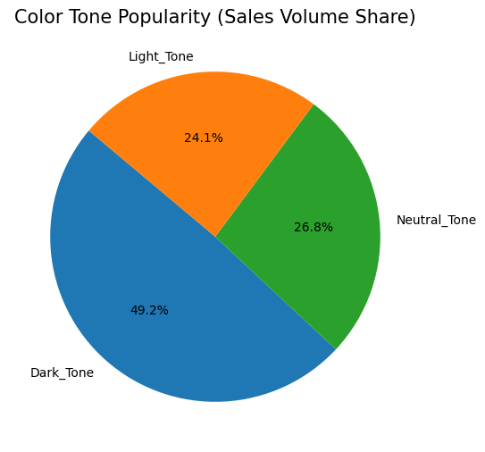
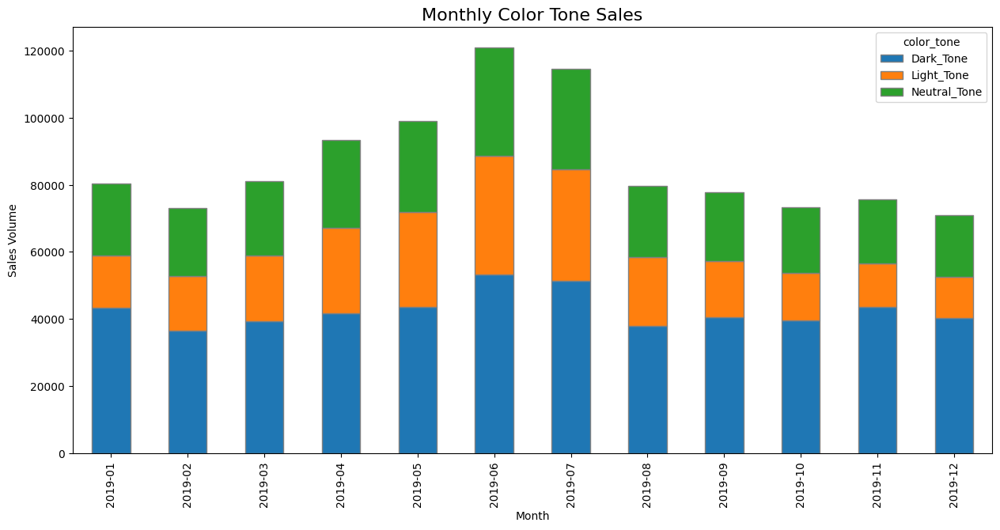

```python
import pandas as pd

# df = pd.read_csv('data/cleaned_data.csv')
df = pd.read_csv('data/cleaned_data.csv', dtype={'article_id': str,'customer_id': str})
```


```python
print(df.head())
print(df.info())
```

            t_dat                                        customer_id  article_id  \
    0  2019-11-05  3e2b60b679e62fb49516105b975560082922011dd752ec...  0698328010   
    1  2019-05-22  89647ac2274f54c770aaa4b326e0eea09610c252381f37...  0760597002   
    2  2019-05-10  2ebe392150feb60ca89caa8eff6c08b7ef1138cd6fdc71...  0488561032   
    3  2019-08-26  7b3205de4ca17a339624eb5e3086698e9984eba6b47c56...  0682771001   
    4  2019-08-10  3b77905de8b32045f08cedb79200cdfa477e9562429a39...  0742400033   
    
          price  sales_channel_id year_month channel   FN  Active  \
    0  0.016932                 2    2019-11     온라인  1.0     1.0   
    1  0.033881                 2    2019-05     온라인  0.0     0.0   
    2  0.016932                 2    2019-05     온라인  1.0     1.0   
    3  0.033881                 2    2019-08     온라인  0.0     0.0   
    4  0.003220                 1    2019-08    오프라인  0.0     0.0   
    
       club_member_status  ...          index_name  index_group_name  \
    0                 2.0  ...             Divided           Divided   
    1                 2.0  ...          Ladieswear        Ladieswear   
    2                 2.0  ...            Menswear          Menswear   
    3                 2.0  ...  Ladies Accessories        Ladieswear   
    4                 2.0  ...            Menswear          Menswear   
    
                 section_name  garment_group_name  \
    0      Divided Collection        Jersey Fancy   
    1           Womens Casual        Jersey Fancy   
    2     Contemporary Casual              Shorts   
    3  Womens Big accessories         Accessories   
    4           Men Underwear    Socks and Tights   
    
                                             detail_desc product_season  \
    0  Top in lightweight sweatshirt fabric with drop...     All-Season   
    1  Short-sleeved blouse in stretch, textured jers...     All-Season   
    2  Knee-length shorts in soft washed cotton with ...     All-Season   
    3  Shopper in grained imitation leather with two ...     All-Season   
    4  Socks in a soft, fine-knit cotton blend with r...             SS   
    
      category_main       product_strategy             is_new  color_tone  
    0       Divided  Low_Involvement_Basic  Regular_Carryover   Dark_Tone  
    1    Ladieswear  Low_Involvement_Basic  Regular_Carryover  Light_Tone  
    2      Menswear        General_Fashion  Regular_Carryover   Dark_Tone  
    3    Ladieswear        General_Fashion  Regular_Carryover   Dark_Tone  
    4      Menswear  Low_Involvement_Basic  Regular_Carryover  Light_Tone  
    
    [5 rows x 32 columns]
    <class 'pandas.DataFrame'>
    RangeIndex: 1040101 entries, 0 to 1040100
    Data columns (total 32 columns):
     #   Column                        Non-Null Count    Dtype  
    ---  ------                        --------------    -----  
     0   t_dat                         1040101 non-null  str    
     1   customer_id                   1040101 non-null  str    
     2   article_id                    1040101 non-null  str    
     3   price                         1040101 non-null  float64
     4   sales_channel_id              1040101 non-null  int64  
     5   year_month                    1040101 non-null  str    
     6   channel                       1040101 non-null  str    
     7   FN                            806367 non-null   float64
     8   Active                        806367 non-null   float64
     9   club_member_status            806367 non-null   float64
     10  fashion_news_frequency        806367 non-null   float64
     11  age                           806367 non-null   float64
     12  age_segment                   806367 non-null   str    
     13  product_code                  1040101 non-null  int64  
     14  prod_name                     1040101 non-null  str    
     15  product_type_name             1040101 non-null  str    
     16  product_group_name            1040101 non-null  str    
     17  graphical_appearance_name     1040101 non-null  str    
     18  colour_group_name             1040101 non-null  str    
     19  perceived_colour_value_name   1040101 non-null  str    
     20  perceived_colour_master_name  1040101 non-null  str    
     21  department_name               1040101 non-null  str    
     22  index_name                    1040101 non-null  str    
     23  index_group_name              1040101 non-null  str    
     24  section_name                  1040101 non-null  str    
     25  garment_group_name            1040101 non-null  str    
     26  detail_desc                   1040101 non-null  str    
     27  product_season                1040101 non-null  str    
     28  category_main                 1040101 non-null  str    
     29  product_strategy              1040101 non-null  str    
     30  is_new                        1040101 non-null  str    
     31  color_tone                    1040101 non-null  str    
    dtypes: float64(6), int64(2), str(24)
    memory usage: 253.9 MB
    None
    


```python
print(df.dtypes)
##csv->파일로 불러오는 경우 id 데이터 타입이 변경될 가능성 있음
# -> 불러올 때 
#df = pd.read_csv('data/cleaned_data.csv', dtype={'article_id': str}) 
```

    t_dat                               str
    customer_id                         str
    article_id                          str
    price                           float64
    sales_channel_id                  int64
    year_month                          str
    channel                             str
    FN                              float64
    Active                          float64
    club_member_status              float64
    fashion_news_frequency          float64
    age                             float64
    age_segment                         str
    product_code                      int64
    prod_name                           str
    product_type_name                   str
    product_group_name                  str
    graphical_appearance_name           str
    colour_group_name                   str
    perceived_colour_value_name         str
    perceived_colour_master_name        str
    department_name                     str
    index_name                          str
    index_group_name                    str
    section_name                        str
    garment_group_name                  str
    detail_desc                         str
    product_season                      str
    category_main                       str
    product_strategy                    str
    is_new                              str
    color_tone                          str
    dtype: object
    


```python
### 생략된 거 어케 보는지 물어봄


import pandas as pd

# 1. 컬럼 출력 제한 해제
pd.set_option('display.max_columns', None)

# 2. 만약 행(Row)도 다 보고 싶다면 (주의: 데이터가 너무 많으면 렉이 걸릴 수 있음)
# pd.set_option('display.max_rows', None)

# 3. 이제 다시 확인해보세요!
print(df.columns.tolist()) # 리스트 형태로 깔끔하게 이름만 다 뽑아보기
# 또는
df.head() # 이제 가로로 스크롤하며 모든 컬럼 확인 가능
```

    ['t_dat', 'customer_id', 'article_id', 'price', 'sales_channel_id', 'year_month', 'channel', 'FN', 'Active', 'club_member_status', 'fashion_news_frequency', 'age', 'age_segment', 'product_code', 'prod_name', 'product_type_name', 'product_group_name', 'graphical_appearance_name', 'colour_group_name', 'perceived_colour_value_name', 'perceived_colour_master_name', 'department_name', 'index_name', 'index_group_name', 'section_name', 'garment_group_name', 'detail_desc', 'product_season', 'category_main', 'product_strategy', 'is_new', 'color_tone']
    


<div>
<style scoped>
    .dataframe tbody tr th:only-of-type {
        vertical-align: middle;
    }

    .dataframe tbody tr th {
        vertical-align: top;
    }

    .dataframe thead th {
        text-align: right;
    }
</style>
<table border="1" class="dataframe">
  <thead>
    <tr style="text-align: right;">
      <th></th>
      <th>t_dat</th>
      <th>customer_id</th>
      <th>article_id</th>
      <th>price</th>
      <th>sales_channel_id</th>
      <th>year_month</th>
      <th>channel</th>
      <th>FN</th>
      <th>Active</th>
      <th>club_member_status</th>
      <th>fashion_news_frequency</th>
      <th>age</th>
      <th>age_segment</th>
      <th>product_code</th>
      <th>prod_name</th>
      <th>product_type_name</th>
      <th>product_group_name</th>
      <th>graphical_appearance_name</th>
      <th>colour_group_name</th>
      <th>perceived_colour_value_name</th>
      <th>perceived_colour_master_name</th>
      <th>department_name</th>
      <th>index_name</th>
      <th>index_group_name</th>
      <th>section_name</th>
      <th>garment_group_name</th>
      <th>detail_desc</th>
      <th>product_season</th>
      <th>category_main</th>
      <th>product_strategy</th>
      <th>is_new</th>
      <th>color_tone</th>
    </tr>
  </thead>
  <tbody>
    <tr>
      <th>0</th>
      <td>2019-11-05</td>
      <td>3e2b60b679e62fb49516105b975560082922011dd752ec...</td>
      <td>0698328010</td>
      <td>0.016932</td>
      <td>2</td>
      <td>2019-11</td>
      <td>온라인</td>
      <td>1.0</td>
      <td>1.0</td>
      <td>2.0</td>
      <td>2.0</td>
      <td>51.0</td>
      <td>50대</td>
      <td>698328</td>
      <td>ZEBRA CF TVP</td>
      <td>Sweater</td>
      <td>Garment Upper body</td>
      <td>Placement print</td>
      <td>Dark Blue</td>
      <td>Dark</td>
      <td>Blue</td>
      <td>Tops Fancy Jersey</td>
      <td>Divided</td>
      <td>Divided</td>
      <td>Divided Collection</td>
      <td>Jersey Fancy</td>
      <td>Top in lightweight sweatshirt fabric with drop...</td>
      <td>All-Season</td>
      <td>Divided</td>
      <td>Low_Involvement_Basic</td>
      <td>Regular_Carryover</td>
      <td>Dark_Tone</td>
    </tr>
    <tr>
      <th>1</th>
      <td>2019-05-22</td>
      <td>89647ac2274f54c770aaa4b326e0eea09610c252381f37...</td>
      <td>0760597002</td>
      <td>0.033881</td>
      <td>2</td>
      <td>2019-05</td>
      <td>온라인</td>
      <td>0.0</td>
      <td>0.0</td>
      <td>2.0</td>
      <td>0.0</td>
      <td>28.0</td>
      <td>20대</td>
      <td>760597</td>
      <td>BUBBLE WRAP TOP</td>
      <td>Top</td>
      <td>Garment Upper body</td>
      <td>Stripe</td>
      <td>White</td>
      <td>Light</td>
      <td>White</td>
      <td>Jersey</td>
      <td>Ladieswear</td>
      <td>Ladieswear</td>
      <td>Womens Casual</td>
      <td>Jersey Fancy</td>
      <td>Short-sleeved blouse in stretch, textured jers...</td>
      <td>All-Season</td>
      <td>Ladieswear</td>
      <td>Low_Involvement_Basic</td>
      <td>Regular_Carryover</td>
      <td>Light_Tone</td>
    </tr>
    <tr>
      <th>2</th>
      <td>2019-05-10</td>
      <td>2ebe392150feb60ca89caa8eff6c08b7ef1138cd6fdc71...</td>
      <td>0488561032</td>
      <td>0.016932</td>
      <td>2</td>
      <td>2019-05</td>
      <td>온라인</td>
      <td>1.0</td>
      <td>1.0</td>
      <td>2.0</td>
      <td>2.0</td>
      <td>37.0</td>
      <td>30대</td>
      <td>488561</td>
      <td>Teddy jogger.</td>
      <td>Shorts</td>
      <td>Garment Lower body</td>
      <td>Chambray</td>
      <td>Dark Blue</td>
      <td>Dark</td>
      <td>Blue</td>
      <td>Shorts</td>
      <td>Menswear</td>
      <td>Menswear</td>
      <td>Contemporary Casual</td>
      <td>Shorts</td>
      <td>Knee-length shorts in soft washed cotton with ...</td>
      <td>All-Season</td>
      <td>Menswear</td>
      <td>General_Fashion</td>
      <td>Regular_Carryover</td>
      <td>Dark_Tone</td>
    </tr>
    <tr>
      <th>3</th>
      <td>2019-08-26</td>
      <td>7b3205de4ca17a339624eb5e3086698e9984eba6b47c56...</td>
      <td>0682771001</td>
      <td>0.033881</td>
      <td>2</td>
      <td>2019-08</td>
      <td>온라인</td>
      <td>0.0</td>
      <td>0.0</td>
      <td>2.0</td>
      <td>0.0</td>
      <td>19.0</td>
      <td>10대</td>
      <td>682771</td>
      <td>Yuki shopper</td>
      <td>Bag</td>
      <td>Accessories</td>
      <td>Solid</td>
      <td>Black</td>
      <td>Dark</td>
      <td>Black</td>
      <td>Bags</td>
      <td>Ladies Accessories</td>
      <td>Ladieswear</td>
      <td>Womens Big accessories</td>
      <td>Accessories</td>
      <td>Shopper in grained imitation leather with two ...</td>
      <td>All-Season</td>
      <td>Ladieswear</td>
      <td>General_Fashion</td>
      <td>Regular_Carryover</td>
      <td>Dark_Tone</td>
    </tr>
    <tr>
      <th>4</th>
      <td>2019-08-10</td>
      <td>3b77905de8b32045f08cedb79200cdfa477e9562429a39...</td>
      <td>0742400033</td>
      <td>0.003220</td>
      <td>1</td>
      <td>2019-08</td>
      <td>오프라인</td>
      <td>0.0</td>
      <td>0.0</td>
      <td>2.0</td>
      <td>0.0</td>
      <td>35.0</td>
      <td>30대</td>
      <td>742400</td>
      <td>1pk Sportsock</td>
      <td>Socks</td>
      <td>Socks &amp; Tights</td>
      <td>All over pattern</td>
      <td>White</td>
      <td>Light</td>
      <td>White</td>
      <td>Socks Wall</td>
      <td>Menswear</td>
      <td>Menswear</td>
      <td>Men Underwear</td>
      <td>Socks and Tights</td>
      <td>Socks in a soft, fine-knit cotton blend with r...</td>
      <td>SS</td>
      <td>Menswear</td>
      <td>Low_Involvement_Basic</td>
      <td>Regular_Carryover</td>
      <td>Light_Tone</td>
    </tr>
  </tbody>
</table>
</div>


### [Data Dictionary] 

#### 1. 파생변수
- **product_strategy** : 상품 관여도 전략 (Basic / Strategic / General)
- **age_segment** : 고객 연령대 세그먼트 (10대 ~ 60대+)
- **is_new** : 신상품 반응 지표 (New_Arrival / Regular_Carryover)
- **product_season** : 상품 시즌 속성 (FW / SS / All-Season)
- **color_tone** : 디자인 톤앤매너 (Dark / Light / Neutral)

#### 2. 기본 정보 (Raw Data)
- **channel** : 온/오프라인 구매 채널 (매출 발생 지점 확인)
- **club_member_status** : 멤버십 등급 (로열티 고객의 구매 유지력 확인)
- **fashion_news_freq** : 마케팅 뉴스레터 구독 빈도 (CRM 활동 영향력 측정)
- **price** : 상품 판매 단가 (객단가 및 가격대별 수요 분석)
- **year_month** : 시간 지표 (6월 정점 대비 8월 하락세의 기준축)
- **category_main** : 여성/남성/아동 등 메인 카테고리 (품목별 성과 측정)

#### 오늘의 분석
1. 톤 분석 (2019 AW 색 이후 트랜드가 이어질 지에 대한)
-> 이것에 대해 통계적으로 유의한지 판단하기 위해서는 추가적으로 통계분석 필요하지만 이번 프로젝트 진행에서는 중점적으로 다루지 않을 것 같음. 
2. 키워드로 잡은 것 : 수영복, 여성복(상의/하의)
3. 이것으로 2020 상반기 전략, 하반기 전략으로 나누어 제시할 수 있음.

아쉬운 점 : article에서 매핑/파생변수 생성할 때 포멀한 옷 디자인, MZ한 디자인 이런 것도 확인할 수 있었으면 20대랑 30대랑 어떤 차이를 보이는지(디자인적으로) 선호도를 파악할 수 있었으면 좋았겠다 라는 생각


1. 온라인 전용 프로모션(누구를 표적고객으로?)
    * 단가가 낮은 저관여 제품을 구매하는 특성을 보유함. 덤이나 배송 할인 등, 혹은 온라인 
2. 비회원 전환 전략(주로 온라인)
3. 

팀원들 의견 중 인상깊었던 점 : 비회원 전환 전략(온라인)을 중점적으로 생각하신 부분과, 채널에 대해 유의미한 영향을 실제로 받는지 통계분석을 생각하고 계신 점이 굉장히 인상깊습니다..! 개인적으로 50, 60대의 경제력을 생각했을 때 베이직한 상품 중 상위권을 차지하고 있는 상하의에 대해서 어떤 전략을 취하면 좋을지 논의해보면 좋을 것 같아요!전체적으로 온라인 채널을 중심으로 전략을 잡으면 어떨까 하신 분이 많으셔서 모두가 생각해봤을 떄에도 온라인 판매량이 의미있게 높았구나 생각이 들었습니다!


신규 고객 vs 탈퇴 고객 : 
대부분 신규 고객을 중심적으로 봐야한다고 생각함. 유지 & new가 컨셉?
전환 고객을 더 중심적으로 보는 팀원 의견도 제시됨. 비회원 -> 회원 전환을 위해서는 어떻게 해야할까? 전략적으로 분석해볼 필요 있음.
* 비회원 유저가 2030 여성층 구매와 비슷한 경향성을 가지고 있다는 분석적 특징 파악
* -> 2030 여성에 맞춘 프로모션을 계획해 비회원과 2030 기존 고객을 노리는 일타이피 전략도 고려해볼 수 있음!
* + 추가적으로 all_season 제품 프로모션도 진행해서 H&M의 주력 상품의 매출 증가를 기대할 수 있음

1. 고객 전환 및 유치 전략 (온라인 위주)
2. 비회원 고객은 2030 여성 고객과 비슷한 경향이 있다는 근거 하에 프로모션 진행해 두마리 토끼를 다 잡아보자!
3. 인기 품목인 all_season 상품으로 프로모션을 진행하면 매출 증가를 기대할 수 있다!


### 팀회의 : 
1. unknown이 비회원이라는 가정을 했지만 고객 거래 빈도를 확인해보면 단발성 고객이라고는 보기 어려웠음(평균 2.23회) 개인정보 정보 동의를 안한 회원이라는 가설이 흥미로웠다.
2. 

가설(인사이트): 만약 2019년 AW에 Dark_Tone 매출이 압도적이었다면, 2020년 SS에는 Light_Tone이 오히려 유행할 가능성도 있음. 보상심리?

<분석>
1. 톤별 매출 기여도
2. 수영복 & 여성복 (상/하의) + 남성복/스포츠
    * 2020 SS 전략 : 2
    * 2020 FW 전략 : 


```python
import matplotlib.pyplot as plt
import seaborn as sns

tone_counts = df['color_tone'].value_counts()

###실제 색에 맞게 코드 추가 (그냥 ㅎ ㅐ보고 싶어서.. 일치감이 중요하니까!)
# 각 조각의 이름을 보고 실제 색상 매핑
color_dict = {'Dark_Tone': 'tab:blue', 'Light_Tone': 'tab:orange', 'Neutral_Tone': 'tab:green'}
colors = [color_dict[label] for label in tone_counts.index]
# Dark_Tone -> 파랑, Light_Tone -> 주황, Neutral_Tone -> 초록
plt.figure(figsize=(6, 6))
plt.pie(tone_counts, 
        labels=tone_counts.index, 
        autopct='%1.1f%%',
        colors=colors,          #지정한 색대로
        startangle=140)
plt.title('Color Tone Popularity (Sales Volume Share)', fontsize=15)
plt.show()
```


    

    


```python
import matplotlib.pyplot as plt
pivot_table = df.pivot_table(index='year_month', columns='color_tone', aggfunc='size', fill_value=0)

#아까 만들어둔 color 순서를 데이터 순서랑 일치시켜야 함
final_table = pivot_table[['Dark_Tone', 'Light_Tone', 'Neutral_Tone']]

final_table.plot(kind='bar', 
                 stacked=True, 
                 figsize=(15, 7), 
                 color=['tab:blue', 'tab:orange', 'tab:green'], #걍 지정해주기
                 edgecolor='gray')

plt.title('Monthly Color Tone Sales', fontsize=16)
plt.ylabel('Sales Volume')
plt.xlabel('Month')
plt.show()
```


    

    


해석 : 전체적으로 다크톤이 높다.
* 사실 봄, 여름에는 시원한 느낌의 색이 어울릴 거라고 생각했는데 예상보다 다크톤에 대한 비중이 높았다. 한국 트랜드와는 다를 수 있으니 이 부분은 탐색해봐야 할듯
* SS 시즌에는 어울리지 않을 거라고 생각했으나 꾸준히 다크톤에 대한 선호도가 높은 만큼 2022 SS도 다크톤에 대한 전략을 세워보면 어떨까?
* 


```python
!python -m jupyter nbconvert --to markdown "03_color.ipynb"
```
