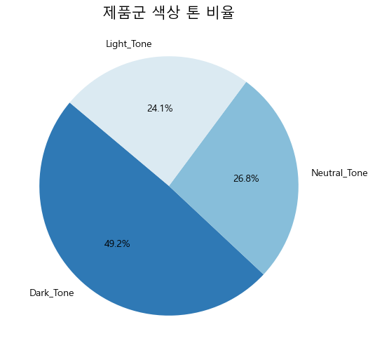
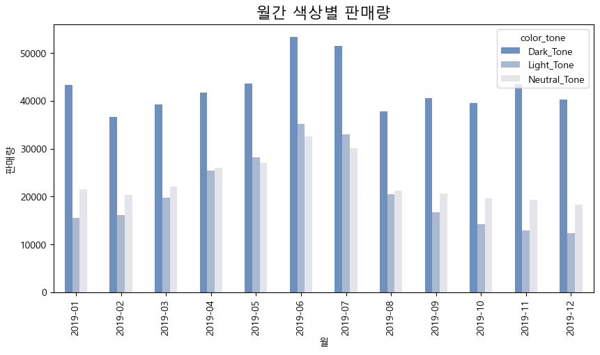
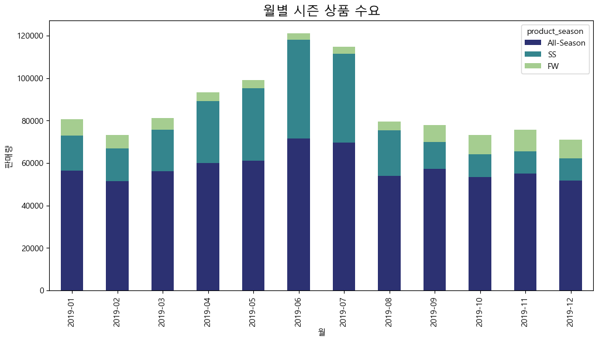
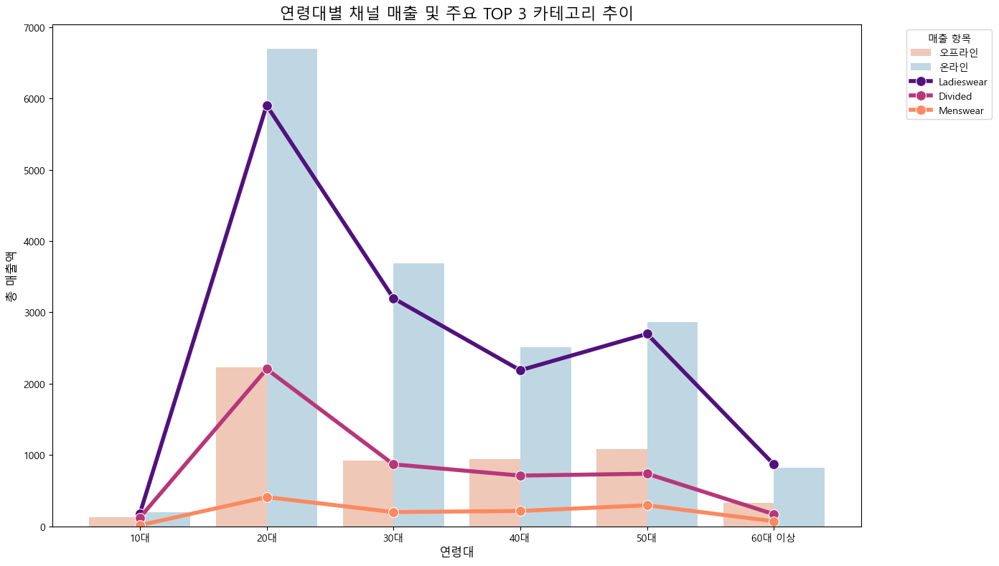
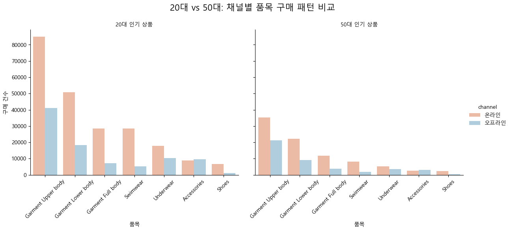

```python
import pandas as pd
import matplotlib.pyplot as plt
import seaborn as sns

df = pd.read_csv('data/cleaned_data.csv', dtype={'article_id': str,'customer_id': str})
```


```python
articles = pd.read_csv("articles_hm.csv")
df_art = articles.copy()

#전처리
#1. ID 형식 통일
df_art['article_id'] = df_art['article_id'].astype(str).str.zfill(10)

#2. 결측치(NULL) 제어 (detail_desc의 NULL값을 No Description로)
df_art['detail_desc'] = df_art['detail_desc'].fillna('No Description')

#3. 불필요 컬럼 제거 (메모리 줄이기) : Name(이름)이 존재하여 중복 정보인 Code(코드성 숫자) 컬럼 불필요
cols_to_drop = [
    'product_type_no', 
    'graphical_appearance_no', 
    'colour_group_code', 
    'perceived_colour_value_id',
    'perceived_colour_master_id',
    'department_no',
    'index_code',
    'index_group_no',
    'section_no',
    'garment_group_no'
]
df_art_cleaned = df_art.drop(columns=cols_to_drop) 
```


```python
## [articles] EDA 시각화

plt.rc('font', family='Malgun Gothic')
plt.rcParams['axes.unicode_minus'] = False

# 1. product_group_name(상품 그룹) 분포 확인 (가로형 막대그래프), 내림차순
plt.figure(figsize=(12, 6))
sns.countplot(
    data=df_art_cleaned, 
    y='product_group_name', 
    order=df_art_cleaned['product_group_name'].value_counts().index,
    palette='pastel'
)
plt.title('상품 그룹 별 분포', fontsize=15)  
plt.xlabel('상품 수')
plt.ylabel('상품 그룹명')
plt.show()

# 2. 카테고리 분포 확인
plt.figure(figsize=(5, 5))
df_art_cleaned['index_group_name'].value_counts().plot.pie(
    autopct='%1.1f%%', 
    startangle=140, 
    colors=sns.color_palette('pastel'),
    ylabel=''   #ylabel False로 설정(위치변경)
)
plt.title('카테고리 분포 확인')
plt.show()
```

    C:\Users\user\AppData\Local\Temp\ipykernel_14756\2120107130.py:8: FutureWarning: 
    
    Passing `palette` without assigning `hue` is deprecated and will be removed in v0.14.0. Assign the `y` variable to `hue` and set `legend=False` for the same effect.
    
      sns.countplot(
    


    

    


    

    


##### 여기부터는 조인한 이후(df)로 간단하게 정리한 것


```python
print("전체 카테고리에서 어떤 카테고리가 가장 판매량이 높은가 (top10)")
total_top_products = df['prod_name'].value_counts().head(10)
print(total_top_products)
```

    전체 카테고리에서 어떤 카테고리가 가장 판매량이 높은가 (top10)
    prod_name
    Jade HW Skinny Denim TRS       5919
    Luna skinny RW                 4561
    Timeless Midrise Brief         2948
    Despacito                      2749
    Cat Tee.                       2629
    Kanta slacks RW                2574
    Simple as That Triangle Top    2499
    Skinny Ankle R.W Brooklyn      2437
    Tilly (1)                      2249
    Shake it in Balconette         2211
    Name: count, dtype: int64
    


```python
df['prod_name'].value_counts().head(10).plot(
    kind='barh', #가로로 볼거임
    color=sns.color_palette('RdBu_r')[1],   #그냥 통일합시다 어 어지러워 색 하나만 씁시다;;
    figsize=(10, 6)
).invert_yaxis()    #내림차순

plt.title('H&M 인기 품목 TOP 10', fontsize=15)
plt.xlabel('판매량')
plt.ylabel('제품명')    #삭제해도 무방
plt.show()
```


    

    


### 일반 제품 내 상위 실제 판매량 순위별로
- 1 : 데님 **팬츠**
- 2 : 스키니 **팬츠**
- 3 : 이너웨어 **하의**
- 4 : 데스..파..시..또... (티셔츠/상의 계열)
- 5 : 캐주얼 상의 (고양이 티셔츠)
- 6 : **슬랙스**(포멀한 정장 계열)
- 7 : 이너웨어 상의
- 8 : 스키니 **팬츠**
- 9 : 이너웨어 상의
- 10 : 이너웨어 상의


```python
# 카테고리 거래 건수
category_counts = df['category_main'].value_counts()

plt.figure(figsize=(6, 6))
plt.pie(
    category_counts, 
    labels=category_counts.index, 
    autopct='%1.1f%%',
    startangle=140, 
    colors=sns.color_palette('pastel'),
)

plt.title('전체 카테고리별 누적 구매 건수 비중', fontsize=15)
plt.show()

#실제 카테고리 별 거래량
print(category_counts)
```


    

    


    category_main
    Ladieswear       672139
    Divided          236753
    Menswear          55812
    Sport             38008
    Baby/Children     37389
    Name: count, dtype: int64
    


```python
# 제품군 색상 톤 비율
tone_counts = df['color_tone'].value_counts()

plt.figure(figsize=(6, 6))
plt.pie(
    tone_counts, 
    labels=tone_counts.index, 
    autopct='%1.1f%%',
    startangle=140,
    colors=sns.color_palette('RdBu_r'))
plt.title('제품군 색상 톤 비율', fontsize=15)
plt.show()
```


    

    


```python
#월간 색상별 판매량
tone_trend = df.groupby(['year_month', 'color_tone']).size().unstack(fill_value=0)  #가로로 펼치고 없으면 0으로 채워~
### 색을 위 파이차트랑 통일하려면
my_tones = ['#2E75B6', '#DDEBF7', '#82B1D1']

tone_trend.plot(
    kind='bar', #area로 두는 게 낫나? 어.... barh? 일단 line은 안되고 그냥 bar로 하고 팀원들과 상의
    # stacked=True,     #이것도 상의 (area, bar로 결정되면) line이면 marker='o'도 붙이쉐이
    # color=sns.color_palette('vlag'),
    color = my_tones,
    figsize=(10, 5)
)

plt.title('월간 색상별 판매량', fontsize=16)
plt.ylabel('판매량')
plt.xlabel('월')
plt.show()
```


    

    


```python
# #월별 카테고리 수요

category_data = df.groupby(['year_month', 'category_main']).size().unstack(fill_value=0)

# category_data.plot(kind='bar', stacked=True, figsize=(15, 8), colormap='mako',width=0.8)

## 가독성이 안좋아서 다시 재배치하고 인덱스 부여한 후 정렬
category_sequence = category_data.sum().sort_values(ascending=False).index
category_data[category_sequence].plot(
    kind='bar', 
    stacked=True, 
    figsize=(12, 6), 
    colormap='viridis')

plt.title('월별 카테고리 수요', fontsize=16)
plt.ylabel('판매량')
plt.xlabel('월')
plt.show()
```


    

    


```python
#시즌별 카테고리 수요

season_data = df.groupby(['year_month', 'product_season']).size().unstack(fill_value=0)
#너도 안되겠다
season_sequence = season_data.sum().sort_values(ascending=False).index
season_data[season_sequence].plot(
    kind='bar', 
    stacked=True, 
    figsize=(12, 6), 
    colormap='crest_r') #로꾸거

plt.title('월별 시즌 상품 수요', fontsize=16)
plt.ylabel('판매량')
plt.xlabel('월')
plt.show()
```


    

    


자 할거 내일
1. 연령대 채널 분석도 가져와서 수정하기 (필요한가? 주제가 흐려질까봐 걱정)
2. 4-2 주석넣기
3. 뭐 .. 뭐하지? 기본 우리 연령대x채널x매출 분석~ 혹은 프로젝트 메인 분석 시각화를 좀 봐야겠다


```python
df_sales = df.groupby(['age_segment', 'channel'])['price'].sum().reset_index()

plt.figure(figsize=(13, 7))
sns.barplot(
    data=df_sales, 
    x='age_segment', 
    y='price', 
    hue='channel',
    palette='RdBu',
    order=['10대', '20대', '30대', '40대', '50대', '60대 이상']
)

plt.title('연령대 및 채널별 누적 매출액 비교', fontsize=16)
plt.xlabel('연령대', fontsize=12)
plt.ylabel('총 매출액', fontsize=12)
plt.legend(title='구매 채널', loc='upper right')

plt.show()
```


    

    


```python
# 0. 위에서쓴거
df_sales = df.groupby(['age_segment', 'channel'])['price'].sum().reset_index()

# 1. 카테고리 분류해서 따로 뽑기
top_3_categories = df.groupby('category_main')['price'].sum().nlargest(3).index.tolist()    #젤큰거3개뽑기
df_cat_top3 = df[df['category_main'].isin(top_3_categories)]
#OR
#my_target_categories = ['Ladieswear', 'Divided', 'Menswear']
#df_cat_target = df[df['category_main'].isin(my_target_categories)] 해도 됨 

# 2. 합쳐서 나눠담기
df_cat_plot = df_cat_top3.groupby(['age_segment', 'category_main'])['price'].sum().reset_index()

plt.figure(figsize=(14, 8))

# 연령대별/채널별 매출
sns.barplot(
    data=df_sales, 
    x='age_segment', 
    y='price', 
    hue='channel',
    palette='RdBu',
    order=['10대', '20대', '30대', '40대', '50대', '60대 이상'],
    alpha=0.8
)

# 라인차트(카테고리)
sns.lineplot(
    data=df_cat_plot,
    x='age_segment',
    y='price',
    hue='category_main',
    hue_order=top_3_categories,
    marker='o',
    markersize=10,
    linewidth=4,
    palette='magma'
)

plt.title(f'연령대별 채널 매출 및 주요 TOP 3 카테고리 추이', fontsize=16)
plt.xlabel('연령대', fontsize=12)
plt.ylabel('총 매출액', fontsize=12)
plt.legend(title='매출 항목', bbox_to_anchor=(1.05, 1), loc='upper left')
plt.tight_layout()
plt.show()

```


    

    


### color_tone 검증
* Dark_Tone :
'black', 'dark blue', 'dark grey', 'dark red', 'dark pink', 'dark purple', 'dark green', 'dark orange', 'dark beige', 'dark turquoise', 'dark yellow', 'grey', 'bronze/copper'

* Light_Tone :
'white', 'off white', 'light beige', 'light blue', 'light grey', 'light orange', 'light pink', 'light green', 'light red', 'light yellow', 'light purple', 'transparent', 'light turquoise'

* Neutral_Tone :
'blue', 'red', 'purple', 'green', 'beige', 'pink', 'silver', 'gold', 'yellow', 'orange', 'turquoise', 'greyish beige', 'yellowish brown', 'greenish khaki', 'other' 시리즈 전체, 'unknown'

* 특이사항 : Other, Unknown는 기타 항목이나 Neutral_Tone에 포함됨

[애매한 녀석들]

1. Light Grey / Light Beige → Light_Tone
2. Silver / Gold → Neutral_Tone
3. Bronze / Copper / Grey → Dark_Tone
4. Transparent → Light_Tone
5. Dark Yellow / Dark Turquoise / Dark Beige → Dark_Tone
6. Other ~~ / Unknown → Neutral_Tone


blue, red 이런 원색도 채도가 높아서 dark로 분류하려다가 그냥 dark 붙은 친구들만 넣고 수정했습니다!! 그래도 압도적으로 많네요.... 수정해서 조금 더 줄어들 줄 알았는데 카테고리 제품 내 다크톤 비중이 크다는 근거로는 충분할 것 같습니다!


```python
##### 검증을 위한 확인
print(df['colour_group_name'].unique())
print("---------------")
print(df['section_name'].unique())
```

    <StringArray>
    [      'Dark Blue',           'White',           'Black',           'Beige',
                 'Red',            'Pink',     'Dark Yellow',            'Blue',
         'Light Beige',      'Light Pink',      'Dark Beige',      'Dark Green',
          'Light Blue', 'Yellowish Brown',            'Grey',       'Off White',
              'Yellow',           'Green',  'Greenish Khaki',      'Light Grey',
        'Light Orange',          'Orange',       'Dark Grey',        'Dark Red',
           'Light Red',       'Dark Pink',       'Other Red',     'Dark Orange',
              'Silver',       'Turquoise',     'Light Green',    'Light Purple',
      'Dark Turquoise',    'Other Yellow',      'Other Pink',     'Other Green',
        'Light Yellow', 'Light Turquoise',            'Gold', 'Other Turquoise',
       'Bronze/Copper',          'Purple',           'Other',    'Other Purple',
         'Dark Purple',   'Greyish Beige',      'Other Blue',    'Other Orange',
         'Transparent',         'Unknown']
    Length: 50, dtype: str
    ---------------
    <StringArray>
    [            'Divided Collection',                  'Womens Casual',
                'Contemporary Casual',         'Womens Big accessories',
                      'Men Underwear',               'Divided Projects',
         'Womens Swimwear, beachwear',     'Womens Everyday Collection',
                   'Womens Tailoring',               'Ladies H&M Sport',
                'Divided Accessories',                 'Womens Jackets',
                       'Womens Shoes',         'Womens Everyday Basics',
                       'Ladies Denim',                 'Divided Basics',
                    'Womens Lingerie',       'Womens Small accessories',
     'Womens Nightwear, Socks & Tigh',                           'H&M+',
                       'Womens Trend',                     'Young Girl',
                     'Collaborations',       'Girls Underwear & Basics',
                               'Mama',                      'Kids Girl',
                   'Divided Selected',  'Baby Essentials & Complements',
              'Men Suits & Tailoring',             'Contemporary Smart',
                          'Young Boy',            'Contemporary Street',
                          'Denim Men',                 'Kids Outerwear',
            'Boys Underwear & Basics',      'Divided Complements Other',
                      'Men H&M Sport',            'Special Collections',
                          'Baby Girl',                       'Kids Boy',
                        'Kids Sports',                      'Men Shoes',
     'Kids Accessories, Swimwear & D',              'Kids & Baby Shoes',
                     'Womens Premium',                'Men Accessories',
                     'Mens Outerwear',                       'Baby Boy',
               'Kids Local Relevance',              'Divided Asia keys',
                        'Men Project',                    'Men Edition',
                        'Men Other 2',                     'EQ Divided',
                          'Men Other',                   'Ladies Other']
    Length: 56, dtype: str
    

### product_season 검증
sports 라인의 socks, jacket 그리고 잘못 기입된 키워드 nightwear가 전부 FW로 분류되는 사고가 있었습니다! 로직 순서를 SS- > FW -> All_season으로 바꿔서 키워드 우선도를 바꿨어요
if~elif 라인 중 FW 키워드가 너무 포괄적으로 잡혀있음을 확인했습니다! SS 우선도(분류하기 쉬운 수영복)으로 바꾸고 FW 범위를 좁혀서(니트, 울, 이런 것만 잡히게) 수정했습니다!
최종 완성 분류는 이렇습니다!


```python
print(df['product_season'].unique())
```

    <StringArray>
    ['All-Season', 'SS', 'FW']
    Length: 3, dtype: str
    


```python
print(df[df['product_season'] == 'FW']['section_name'].unique())
print("\n------------")
print(df[df['product_season'] == 'SS']['section_name'].unique())
print("\n------------")
print(df[df['product_season'] == 'All-Season']['section_name'].unique())
```

    <StringArray>
    [                'Womens Jackets',                 'Divided Basics',
                 'Divided Collection',                 'Collaborations',
                   'Divided Selected',                  'Womens Casual',
         'Womens Everyday Collection',                 'Kids Outerwear',
                      'Men Underwear',        'Boys Underwear & Basics',
             'Womens Big accessories',               'Womens Tailoring',
      'Baby Essentials & Complements', 'Womens Nightwear, Socks & Tigh',
                       'Womens Trend',            'Special Collections',
                     'Mens Outerwear',                'Men Accessories',
           'Womens Small accessories',            'Divided Accessories',
               'Kids Local Relevance',                   'Ladies Denim',
          'Divided Complements Other',              'Divided Asia keys',
                     'Womens Premium',                           'H&M+',
                 'Contemporary Smart',               'Divided Projects',
                'Contemporary Street',                      'Baby Girl',
                          'Kids Girl',                    'Men Project',
                'Contemporary Casual',                     'Young Girl',
             'Womens Everyday Basics',                'Womens Lingerie',
                          'Young Boy',                       'Baby Boy',
              'Men Suits & Tailoring',                       'Kids Boy',
                               'Mama',                   'Womens Shoes',
                  'Kids & Baby Shoes',                    'Men Edition',
                        'Men Other 2',       'Girls Underwear & Basics',
                          'Denim Men',                      'Men Shoes']
    Length: 48, dtype: str
    
    ------------
    <StringArray>
    [                 'Men Underwear',               'Divided Projects',
         'Womens Swimwear, beachwear',             'Divided Collection',
                   'Ladies H&M Sport',               'Womens Tailoring',
         'Womens Everyday Collection',                 'Divided Basics',
                       'Ladies Denim',                   'Womens Trend',
                               'H&M+',       'Womens Small accessories',
             'Womens Big accessories',  'Baby Essentials & Complements',
                      'Womens Casual', 'Womens Nightwear, Socks & Tigh',
             'Womens Everyday Basics',            'Contemporary Street',
                   'Divided Selected',                           'Mama',
                      'Men H&M Sport',                      'Denim Men',
                         'Young Girl',                    'Kids Sports',
     'Kids Accessories, Swimwear & D',                       'Kids Boy',
          'Divided Complements Other',                      'Young Boy',
            'Boys Underwear & Basics',                 'Womens Premium',
                'Divided Accessories',                      'Kids Girl',
                    'Womens Lingerie',       'Girls Underwear & Basics',
                       'Womens Shoes',                       'Baby Boy',
                'Special Collections',             'Contemporary Smart',
                          'Baby Girl',                'Men Accessories',
                'Contemporary Casual',                 'Collaborations',
               'Kids Local Relevance',                     'EQ Divided',
                  'Divided Asia keys',          'Men Suits & Tailoring',
                     'Mens Outerwear',                      'Men Shoes',
                        'Men Project',                 'Womens Jackets',
                        'Men Other 2',                 'Kids Outerwear',
                  'Kids & Baby Shoes',                    'Men Edition']
    Length: 54, dtype: str
    
    ------------
    <StringArray>
    [            'Divided Collection',                  'Womens Casual',
                'Contemporary Casual',         'Womens Big accessories',
         'Womens Everyday Collection',               'Womens Tailoring',
                'Divided Accessories',                   'Womens Shoes',
             'Womens Everyday Basics',                   'Ladies Denim',
                    'Womens Lingerie',       'Womens Small accessories',
     'Womens Nightwear, Socks & Tigh',                           'H&M+',
                      'Men Underwear',                   'Womens Trend',
                         'Young Girl',       'Girls Underwear & Basics',
                               'Mama',                      'Kids Girl',
                     'Divided Basics',          'Men Suits & Tailoring',
                   'Divided Selected',             'Contemporary Smart',
                          'Young Boy',               'Divided Projects',
                          'Denim Men',                 'Collaborations',
            'Boys Underwear & Basics',  'Baby Essentials & Complements',
          'Divided Complements Other',            'Contemporary Street',
                'Special Collections',                      'Baby Girl',
                           'Kids Boy',                      'Men Shoes',
                  'Kids & Baby Shoes',                 'Womens Premium',
                    'Men Accessories',           'Kids Local Relevance',
                           'Baby Boy',                    'Men Project',
                        'Men Edition',              'Divided Asia keys',
                        'Men Other 2',                      'Men Other',
                         'EQ Divided',                   'Ladies Other']
    Length: 48, dtype: str
    


```python
print(df[df['product_season'] == 'FW']['prod_name'].unique())
print("\n------------")
print(df[df['product_season'] == 'SS']['prod_name'].unique())
print("\n------------")
print(df[df['product_season'] == 'All-Season']['prod_name'].unique())
```

    <StringArray>
    [        'Baloo Hood Padded',              'Becka hoodie',
            'Aruba denim jacket',           'PE DANIELA COAT',
              'Calgary Cardigan',           'Sean wool biker',
      'Maltese trow on cardigan',            'Barry cardigan',
     'Girona throw on wool coat',               'Furi tights',
     ...
          'BB BEANIE JERSEY OWN',          'BUCKET HAT BASIC',
              'CE Anderson coat',           'FLORINA fur jkt',
       'Christy Pile Jacket (1)',          'SB Parker Hybrid',
           'DIV Hellas cardigan',  'PREMIUM Sasha wool scarf',
                        'Kvaser',     'NILLA stripe cardigan']
    Length: 1961, dtype: str
    
    ------------
    <StringArray>
    [              '1pk Sportsock', 'RR 47.1/2 /3Leo shirt dress',
        'Timeless Padded Swimsuit',             'SANNA SLIP TANK',
         'Chia Seamless HW Tights',       'Vermont Summer Slacks',
                  'Tory price tee',                'Locket dress',
          'Shake it in Balconette',      'LS Olivia Triangle Top',
     ...
                    'Smilla dress',                   'HW shorts',
                    'Sunset Fancy',       'SW Mini Kyla swimsuit',
                    'RASPY shorts',            'PE BECK SWIMSUIT',
                  'WILMA ls dress',            'HAILEY SKIRT S.1',
                 'Cleopatra skirt', 'SPEED Choker 2pk glitter P5']
    Length: 6097, dtype: str
    
    ------------
    <StringArray>
    [       'ZEBRA CF TVP',     'BUBBLE WRAP TOP',       'Teddy jogger.',
            'Yuki shopper',        'AGNES isw 45',      'Hazel playsuit',
                  'Athena',   'Bonita WH tapered',              'Yellow',
      'CHLOE cosmetic bag',
     ...
     'Speed Penut Earring',     'SALT 2-pack tee',  'Basic 5p Shaftless',
      'Zen detailed shirt',             'Randall',           'Elvis top',
      'Unicorn slipper SG',      'PLUS SKINNY SS',    'CNY Badger Fancy',
              'Meow denim']
    Length: 17109, dtype: str
    


```python
!python -m jupyter nbconvert --to markdown "04_code_collection.ipynb"
```
