```python
import pandas as pd
import numpy as np
import matplotlib.pyplot as plt
import seaborn as sns

# [Step 1] 원본 데이터 로드 및 복사
customer = pd.read_csv("customer_hm.csv")
transactions = pd.read_csv("transactions_hm.csv")
articles = pd.read_csv("articles_hm.csv")

#copy
df_cust = customer.copy()
df_tran = transactions.copy()
df_art = articles.copy()

plt.rc('font', family='Malgun Gothic')
plt.rcParams['axes.unicode_minus'] = False

```


```python
df_tran.head()
```


<div>
<style scoped>
    .dataframe tbody tr th:only-of-type {
        vertical-align: middle;
    }

    .dataframe tbody tr th {
        vertical-align: top;
    }

    .dataframe thead th {
        text-align: right;
    }
</style>
<table border="1" class="dataframe">
  <thead>
    <tr style="text-align: right;">
      <th></th>
      <th>t_dat</th>
      <th>customer_id</th>
      <th>article_id</th>
      <th>price</th>
      <th>sales_channel_id</th>
    </tr>
  </thead>
  <tbody>
    <tr>
      <th>0</th>
      <td>2019-11-05</td>
      <td>3e2b60b679e62fb49516105b975560082922011dd752ec...</td>
      <td>698328010</td>
      <td>0.016932</td>
      <td>2</td>
    </tr>
    <tr>
      <th>1</th>
      <td>2019-05-22</td>
      <td>89647ac2274f54c770aaa4b326e0eea09610c252381f37...</td>
      <td>760597002</td>
      <td>0.033881</td>
      <td>2</td>
    </tr>
    <tr>
      <th>2</th>
      <td>2019-05-10</td>
      <td>2ebe392150feb60ca89caa8eff6c08b7ef1138cd6fdc71...</td>
      <td>488561032</td>
      <td>0.016932</td>
      <td>2</td>
    </tr>
    <tr>
      <th>3</th>
      <td>2019-08-26</td>
      <td>7b3205de4ca17a339624eb5e3086698e9984eba6b47c56...</td>
      <td>682771001</td>
      <td>0.033881</td>
      <td>2</td>
    </tr>
    <tr>
      <th>4</th>
      <td>2019-08-10</td>
      <td>3b77905de8b32045f08cedb79200cdfa477e9562429a39...</td>
      <td>742400033</td>
      <td>0.003220</td>
      <td>1</td>
    </tr>
  </tbody>
</table>
</div>


```python
df_tran['customer_id']= df_tran['customer_id'].astype(str).str.zfill(10)
df_cust['customer_id']= df_cust['customer_id'].astype(str).str.zfill(10)

df_tran['article_id']= df_tran['article_id'].astype(str).str.zfill(10)
df_art['article_id'] = df_art['article_id'].astype(str).str.zfill(10)
```


```python
df_art.info()
```

    <class 'pandas.DataFrame'>
    RangeIndex: 105542 entries, 0 to 105541
    Data columns (total 25 columns):
     #   Column                        Non-Null Count   Dtype
    ---  ------                        --------------   -----
     0   article_id                    105542 non-null  str  
     1   product_code                  105542 non-null  int64
     2   prod_name                     105542 non-null  str  
     3   product_type_no               105542 non-null  int64
     4   product_type_name             105542 non-null  str  
     5   product_group_name            105542 non-null  str  
     6   graphical_appearance_no       105542 non-null  int64
     7   graphical_appearance_name     105542 non-null  str  
     8   colour_group_code             105542 non-null  int64
     9   colour_group_name             105542 non-null  str  
     10  perceived_colour_value_id     105542 non-null  int64
     11  perceived_colour_value_name   105542 non-null  str  
     12  perceived_colour_master_id    105542 non-null  int64
     13  perceived_colour_master_name  105542 non-null  str  
     14  department_no                 105542 non-null  int64
     15  department_name               105542 non-null  str  
     16  index_code                    105542 non-null  str  
     17  index_name                    105542 non-null  str  
     18  index_group_no                105542 non-null  int64
     19  index_group_name              105542 non-null  str  
     20  section_no                    105542 non-null  int64
     21  section_name                  105542 non-null  str  
     22  garment_group_no              105542 non-null  int64
     23  garment_group_name            105542 non-null  str  
     24  detail_desc                   105126 non-null  str  
    dtypes: int64(10), str(15)
    memory usage: 20.1 MB
    


```python
df_cust.info()
```

    <class 'pandas.DataFrame'>
    RangeIndex: 1048575 entries, 0 to 1048574
    Data columns (total 6 columns):
     #   Column                  Non-Null Count    Dtype
    ---  ------                  --------------    -----
     0   customer_id             1048575 non-null  str  
     1   FN                      1048575 non-null  int64
     2   Active                  1048575 non-null  int64
     3   club_member_status      1048575 non-null  str  
     4   fashion_news_frequency  1048574 non-null  str  
     5   age                     1048575 non-null  int64
    dtypes: int64(3), str(3)
    memory usage: 48.0 MB
    


```python
df_tran.info()
```

    <class 'pandas.DataFrame'>
    RangeIndex: 1048575 entries, 0 to 1048574
    Data columns (total 5 columns):
     #   Column            Non-Null Count    Dtype  
    ---  ------            --------------    -----  
     0   t_dat             1048575 non-null  str    
     1   customer_id       1048575 non-null  str    
     2   article_id        1048575 non-null  str    
     3   price             1048575 non-null  float64
     4   sales_channel_id  1048575 non-null  int64  
    dtypes: float64(1), int64(1), str(3)
    memory usage: 40.0 MB
    


```python
print(df_cust.shape)
print(df_art.shape)
print(df_tran.shape)
```

    (1048575, 6)
    (105542, 25)
    (1048575, 5)
    


```python
### 전처리 시작

print(df_cust.isnull().sum())
```

    customer_id               0
    FN                        0
    Active                    0
    club_member_status        0
    fashion_news_frequency    1
    age                       0
    dtype: int64
    


```python
df_cust[df_cust['fashion_news_frequency'].isnull()]
```


<div>
<style scoped>
    .dataframe tbody tr th:only-of-type {
        vertical-align: middle;
    }

    .dataframe tbody tr th {
        vertical-align: top;
    }

    .dataframe thead th {
        text-align: right;
    }
</style>
<table border="1" class="dataframe">
  <thead>
    <tr style="text-align: right;">
      <th></th>
      <th>customer_id</th>
      <th>FN</th>
      <th>Active</th>
      <th>club_member_status</th>
      <th>fashion_news_frequency</th>
      <th>age</th>
    </tr>
  </thead>
  <tbody>
    <tr>
      <th>876108</th>
      <td>a79d9cbfaceb0d25a91caccfad167d4d6391fd5bb4292b...</td>
      <td>1</td>
      <td>0</td>
      <td>ACTIVE</td>
      <td>NaN</td>
      <td>38</td>
    </tr>
  </tbody>
</table>
</div>


```python
df_cust['fashion_news_frequency'] = df_cust['fashion_news_frequency'].fillna("Unknown_but_FN1")
#FN 컬럼 값이 1로 구독중인 것을 확인 했기 때문에
#fashion_news_frequency의 결측치는 "Unknown_but_FN1"로 눈으로 보기 쉽게 작성
```


```python
df_cust[df_cust['fashion_news_frequency'].isnull()]
```


<div>
<style scoped>
    .dataframe tbody tr th:only-of-type {
        vertical-align: middle;
    }

    .dataframe tbody tr th {
        vertical-align: top;
    }

    .dataframe thead th {
        text-align: right;
    }
</style>
<table border="1" class="dataframe">
  <thead>
    <tr style="text-align: right;">
      <th></th>
      <th>customer_id</th>
      <th>FN</th>
      <th>Active</th>
      <th>club_member_status</th>
      <th>fashion_news_frequency</th>
      <th>age</th>
    </tr>
  </thead>
  <tbody>
  </tbody>
</table>
</div>


```python
df_cust['fashion_news_frequency'].value_counts()
```


    fashion_news_frequency
    NONE               674698
    Regularly          373218
    Monthly               658
    Unknown_but_FN1         1
    Name: count, dtype: int64


```python
df_cust['age_group'] = (df_cust['age'] // 10) * 10
print(df_cust['age_group'].value_counts())
df_cust['age_group'].value_counts(normalize=True)*100
```

    age_group
    20    409196
    30    181112
    50    174715
    40    157445
    60     56124
    10     55256
    70     13580
    80      1075
    90        72
    Name: count, dtype: int64
    


    age_group
    20    39.024009
    30    17.272203
    50    16.662137
    40    15.015140
    60     5.352407
    10     5.269628
    70     1.295091
    80     0.102520
    90     0.006866
    Name: proportion, dtype: float64


```python
def cate_age(age):
    if age < 20: return '10대'
    elif age < 30: return '20대'
    elif age < 40: return '30대'
    elif age < 50: return '40대'
    elif age < 60: return'50대'
    else: return '60대 이상'

df_cust = df_cust[(df_cust['age'] >= 10) & (df_cust['age'] <= 100)]
df_cust['age_segment'] = df_cust['age'].apply(cate_age)
```


```python

age_order = ['10대', '20대', '30대', '40대', '50대', '60대 이상']
age_cnt = df_cust['age_segment'].value_counts().reindex(age_order)
age_pct = (age_cnt / age_cnt.sum() * 100).round(1)

df_cust['age_segment'] = pd.Categorical(
    df_cust['age_segment'],
    categories=age_order,
    ordered=True
)

ax = sns.countplot(
    x='age_segment',
    data=df_cust,
    order=df_cust['age_segment'].cat.categories,
    palette='pastel',
    legend=False
)

# 막대 위에 비율 표시
for i, bar in enumerate(ax.patches):
    height = bar.get_height()
    if height > 0:
        pct = age_pct.iloc[i]
        ax.text(
            bar.get_x() + bar.get_width() / 2,
            height,
            f'{pct}%',
            ha='center',
            va='bottom',
            fontsize=10
        )
plt.title('고객 기본 구조 (연령대별 비율)', fontsize=16)
plt.xlabel('연령대', fontsize=12)
plt.ylabel('count', fontsize=12)
plt.grid(axis='y', linestyle='--', alpha=0.5)
plt.tight_layout()
plt.show()
```

    C:\Users\user\AppData\Local\Temp\ipykernel_4428\822583366.py:11: FutureWarning: 
    
    Passing `palette` without assigning `hue` is deprecated and will be removed in v0.14.0. Assign the `x` variable to `hue` and set `legend=False` for the same effect.
    
      ax = sns.countplot(
    


    
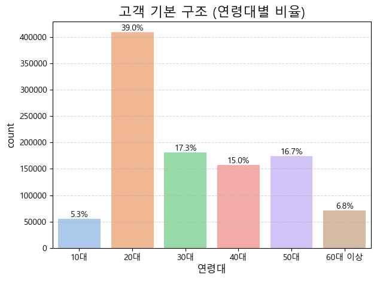
    


```python
# [Transactions] 데이터 전처리
df_tran.info()
```

    <class 'pandas.DataFrame'>
    RangeIndex: 1048575 entries, 0 to 1048574
    Data columns (total 5 columns):
     #   Column            Non-Null Count    Dtype  
    ---  ------            --------------    -----  
     0   t_dat             1048575 non-null  str    
     1   customer_id       1048575 non-null  str    
     2   article_id        1048575 non-null  str    
     3   price             1048575 non-null  float64
     4   sales_channel_id  1048575 non-null  int64  
    dtypes: float64(1), int64(1), str(3)
    memory usage: 40.0 MB
    


```python
df_tran.isnull().sum()
```


    t_dat               0
    customer_id         0
    article_id          0
    price               0
    sales_channel_id    0
    dtype: int64


```python
df_tran["t_dat"] = pd.to_datetime(df_tran["t_dat"], format="%Y-%m-%d")
```


```python
df_tran.info()
```

    <class 'pandas.DataFrame'>
    RangeIndex: 1048575 entries, 0 to 1048574
    Data columns (total 5 columns):
     #   Column            Non-Null Count    Dtype         
    ---  ------            --------------    -----         
     0   t_dat             1048575 non-null  datetime64[us]
     1   customer_id       1048575 non-null  str           
     2   article_id        1048575 non-null  str           
     3   price             1048575 non-null  float64       
     4   sales_channel_id  1048575 non-null  int64         
    dtypes: datetime64[us](1), float64(1), int64(1), str(2)
    memory usage: 40.0 MB
    


```python
df_tran["channel"] = df_tran["sales_channel_id"].map({1: "Offline", 2: "Online"})
```


```python
df_tran["channel"].value_counts()
numbs = df_tran["channel"].value_counts()
print("온라인:", f"{numbs['Online']:,}")
print("오프라인:", f"{numbs['Offline']:,}")
print("전체 거래 건수:", f"{df_tran.shape[0]:,}")
```

    온라인: 729,192
    오프라인: 319,383
    전체 거래 건수: 1,048,575
    


```python
plt.figure(figsize=(7, 7))
# 조각 하나 살짝 띄우기
explode = [0, 0.10]
numbs.plot.pie(
    autopct='%.1f%%',          # 퍼센트 표시
    startangle=260,            # 시작 각도
    colors=['pink', 'skyblue'],
    ylabel='',
    explode=explode
)
plt.title("H&M 온라인 vs 오프라인 판매 비중", fontsize=15)
plt.savefig('channel_pie.png', dpi=300)
plt.show()
```


    
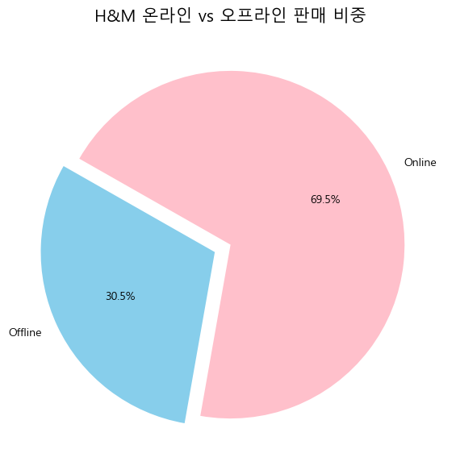
    


```python
df_tran['price'].describe() 
print("price가 0.1 이상:", len(df_tran[df_tran["price"] >= 0.1]))
print("price가 0.2 이상:", len(df_tran[df_tran["price"] >= 0.2]))
print("price가 0.3 이상:", len(df_tran[df_tran["price"] >= 0.3]))
print("price가 0.4 이상:", len(df_tran[df_tran["price"] >= 0.4]))
print("price가 0.5 이상:", len(df_tran[df_tran["price"] >= 0.5]))

```

    price가 0.1 이상: 10803
    price가 0.2 이상: 724
    price가 0.3 이상: 127
    price가 0.4 이상: 29
    price가 0.5 이상: 2
    


```python
labels = ['0.1 이상', '0.2 이상', '0.3 이상', '0.4 이상', '0.5 이상']
counts = [
    len(df_tran[df_tran["price"] >= 0.1]),
    len(df_tran[df_tran["price"] >= 0.2]),
    len(df_tran[df_tran["price"] >= 0.3]),
    len(df_tran[df_tran["price"] >= 0.4]),
    len(df_tran[df_tran["price"] >= 0.5])
]

plt.figure(figsize=(10, 6))
colors = sns.color_palette("coolwarm", len(labels)) # 가격이 올라갈수록 진해지는 색상

bars = plt.bar(labels, counts, color=colors, edgecolor='black', alpha=0.8)

# 막대 위에 실제 거래 건수 표시 (콤마 포함)
for bar in bars:
    height = bar.get_height()
    plt.text(bar.get_x() + bar.get_width()/2., height,
            f'{int(height):,}건', ha='center', va='bottom', fontsize=12, fontweight='bold')


plt.title('가격 기준별 거래 건수 분포', fontsize=18, pad=20, color='#333333')
plt.xlabel('가격 기준 (Price Threshold)', fontsize=14)
plt.ylabel('거래 건수 (건)', fontsize=14)

plt.savefig('price_.png', dpi=300)
plt.show()
```


    
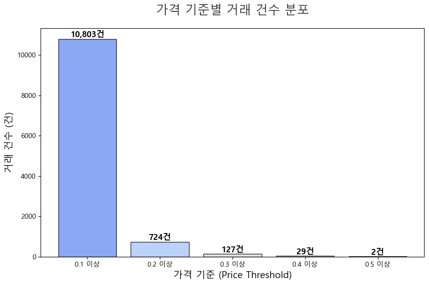
    


```python
# 가격대를 일정 구간으로 나누어 매출 합계 계산
# 시각화를 위해 0.01 단위로 끊어서 매출 비중을 볼 수 있도록 설정
df_tran['price_group'] = df_tran['price'].round(2) # 가격을 소수점 둘째자리로 반올림
revenue_dist = df_tran.groupby('price_group')['price'].sum().reset_index()

plt.figure(figsize=(12, 7))
sns.barplot(data=revenue_dist[revenue_dist['price_group'] <= 0.2], 
            x='price_group', y='price', color='salmon')

plt.title('가격대별 총 매출액 기여도 (0.2 이하 구간)', fontsize=16, pad=20)
plt.xlabel('상품 가격 (Price)', fontsize=12)
plt.ylabel('총 매출 합계 (Total Revenue)', fontsize=12)
plt.xticks(rotation=45) # 글자가 겹치지 않게 회전
plt.savefig('price_bar_chart.png', dpi=300)
plt.show()
```


    
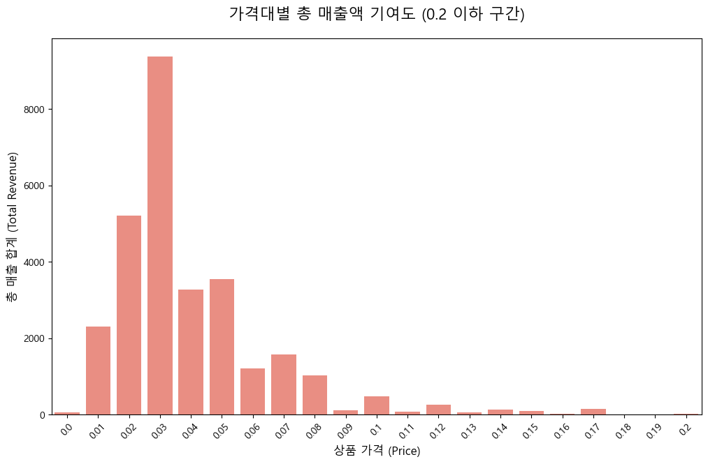
    


```python
high_price_transactions = df_tran[df_tran["price"] >= 0.1]
high_price_transactions['channel'].replace({1: 'Offline', 2: 'Online'}).value_counts()

channel_counts = (
    high_price_transactions['channel']
    .replace({1: 'Offline', 2: 'Online'})
    .value_counts()
)

channel_ratio = channel_counts / channel_counts.sum() * 100

result_df = pd.DataFrame({
    'count': channel_counts,
    'ratio(%)': channel_ratio.round(2)
})

result_df

```


<div>
<style scoped>
    .dataframe tbody tr th:only-of-type {
        vertical-align: middle;
    }

    .dataframe tbody tr th {
        vertical-align: top;
    }

    .dataframe thead th {
        text-align: right;
    }
</style>
<table border="1" class="dataframe">
  <thead>
    <tr style="text-align: right;">
      <th></th>
      <th>count</th>
      <th>ratio(%)</th>
    </tr>
    <tr>
      <th>channel</th>
      <th></th>
      <th></th>
    </tr>
  </thead>
  <tbody>
    <tr>
      <th>Online</th>
      <td>9875</td>
      <td>91.41</td>
    </tr>
    <tr>
      <th>Offline</th>
      <td>928</td>
      <td>8.59</td>
    </tr>
  </tbody>
</table>
</div>


```python
df_tran['year_month'] = df_tran['t_dat'].dt.to_period('M')
```


```python
monthly_sales = df_tran.groupby('year_month').size()
monthly_price = df_tran.groupby('year_month')['price'].sum()

print(monthly_price)
```

    year_month
    2019-01    2148.279639
    2019-02    2006.034201
    2019-03    2395.173487
    2019-04    2725.229843
    2019-05    2768.568961
    2019-06    3113.444654
    2019-07    2571.945537
    2019-08    1960.310828
    2019-09    2581.655388
    2019-10    2376.303726
    2019-11    2482.021880
    2019-12    1999.556979
    Freq: M, Name: price, dtype: float64
    


```python
best_month = monthly_price.idxmax()
best_value = monthly_price.max()

print("가장 매출이 높은 달:", best_month)
print("그 달의 매출:", best_value) 
```

    가장 매출이 높은 달: 2019-06
    그 달의 매출: 3113.444654044
    


```python
plt.figure(figsize=(10,5))
monthly_price.plot()

plt.scatter(best_month.to_timestamp(), best_value)
plt.text(best_month.to_timestamp(), best_value, 
         f"  BEST: {best_month}", fontsize=10)

plt.title("월간 총 판매 추이", fontsize=16, pad=20)
plt.xlabel("분석 시기", fontsize=12)
plt.ylabel("총 매출액", fontsize=12)
plt.xticks(rotation=45)
plt.tight_layout()
plt.show()
#Y축은 0에서 시작되지 않음을 설명합시다.
```


    
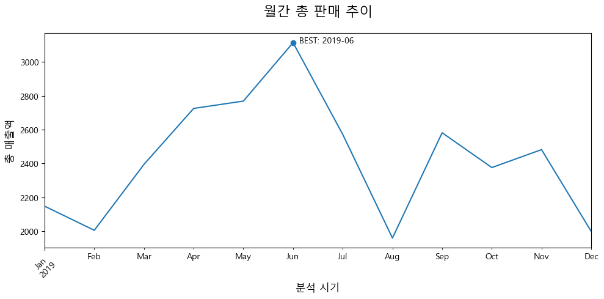
    


```python
plt.figure(figsize=(10,5))
monthly_sales.plot()
plt.title("월간 판매량 및 거래 추이", fontsize=16, pad=20)
plt.xlabel("분석 시기 (Month)", fontsize=12)
plt.ylabel("판매 건수 (Transactions)", fontsize=12)
plt.xticks(rotation=45)
plt.tight_layout()
plt.show()
```


    
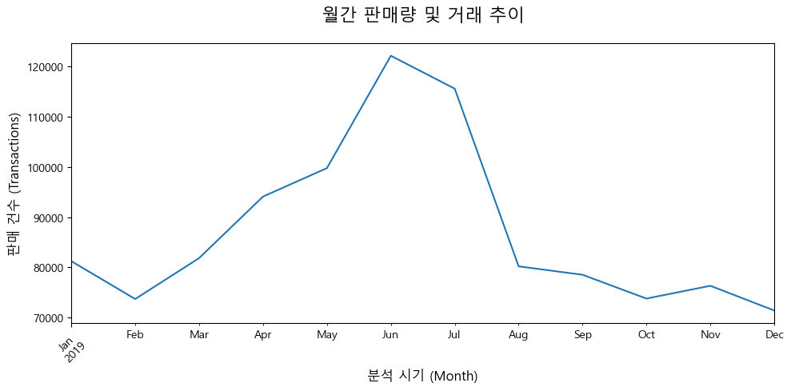
    


```python
# [Article] 데이터 전처리: 상품 전략 파생변수 생성
df_art.info()
```

    <class 'pandas.DataFrame'>
    RangeIndex: 105542 entries, 0 to 105541
    Data columns (total 25 columns):
     #   Column                        Non-Null Count   Dtype
    ---  ------                        --------------   -----
     0   article_id                    105542 non-null  str  
     1   product_code                  105542 non-null  int64
     2   prod_name                     105542 non-null  str  
     3   product_type_no               105542 non-null  int64
     4   product_type_name             105542 non-null  str  
     5   product_group_name            105542 non-null  str  
     6   graphical_appearance_no       105542 non-null  int64
     7   graphical_appearance_name     105542 non-null  str  
     8   colour_group_code             105542 non-null  int64
     9   colour_group_name             105542 non-null  str  
     10  perceived_colour_value_id     105542 non-null  int64
     11  perceived_colour_value_name   105542 non-null  str  
     12  perceived_colour_master_id    105542 non-null  int64
     13  perceived_colour_master_name  105542 non-null  str  
     14  department_no                 105542 non-null  int64
     15  department_name               105542 non-null  str  
     16  index_code                    105542 non-null  str  
     17  index_name                    105542 non-null  str  
     18  index_group_no                105542 non-null  int64
     19  index_group_name              105542 non-null  str  
     20  section_no                    105542 non-null  int64
     21  section_name                  105542 non-null  str  
     22  garment_group_no              105542 non-null  int64
     23  garment_group_name            105542 non-null  str  
     24  detail_desc                   105126 non-null  str  
    dtypes: int64(10), str(15)
    memory usage: 20.1 MB
    


```python
df_art.isnull().sum() 
```


    article_id                        0
    product_code                      0
    prod_name                         0
    product_type_no                   0
    product_type_name                 0
    product_group_name                0
    graphical_appearance_no           0
    graphical_appearance_name         0
    colour_group_code                 0
    colour_group_name                 0
    perceived_colour_value_id         0
    perceived_colour_value_name       0
    perceived_colour_master_id        0
    perceived_colour_master_name      0
    department_no                     0
    department_name                   0
    index_code                        0
    index_name                        0
    index_group_no                    0
    index_group_name                  0
    section_no                        0
    section_name                      0
    garment_group_no                  0
    garment_group_name                0
    detail_desc                     416
    dtype: int64


```python
df_art["detail_desc"] = df_art["detail_desc"].fillna("No description")
#결측치를 'No description'으로 대체
```


```python
df_art.isnull().sum()
```


    article_id                      0
    product_code                    0
    prod_name                       0
    product_type_no                 0
    product_type_name               0
    product_group_name              0
    graphical_appearance_no         0
    graphical_appearance_name       0
    colour_group_code               0
    colour_group_name               0
    perceived_colour_value_id       0
    perceived_colour_value_name     0
    perceived_colour_master_id      0
    perceived_colour_master_name    0
    department_no                   0
    department_name                 0
    index_code                      0
    index_name                      0
    index_group_no                  0
    index_group_name                0
    section_no                      0
    section_name                    0
    garment_group_no                0
    garment_group_name              0
    detail_desc                     0
    dtype: int64


```python
df_art['detail_desc'].value_counts().head()
```


    detail_desc
    No description                                                        416
    T-shirt in printed cotton jersey.                                     159
    Leggings in soft organic cotton jersey with an elasticated waist.     138
    T-shirt in soft, printed cotton jersey.                               137
    Socks in a soft, jacquard-knit cotton blend with elasticated tops.    136
    Name: count, dtype: int64


```python
cols_to_drop = [
    'product_type_no', 
    'graphical_appearance_no', 
    'colour_group_code', 
    'perceived_colour_value_id',
    'perceived_colour_master_id',
    'department_no',
    'index_code',
    'index_group_no',
    'section_no',
    'garment_group_no'
]
df_art_cleaned = df_art.drop(columns=cols_to_drop) 
```


```python
## [articles] EDA 시각화

# 1. product_group_name(상품 그룹) 분포 확인 (가로형 막대그래프), 내림차순
plt.figure(figsize=(12, 6))
sns.countplot(
    data=df_art_cleaned, 
    y='product_group_name', 
    order=df_art_cleaned['product_group_name'].value_counts().index,
    hue='product_group_name',    #개선점 말해줘서 변경
    palette='pastel',
    legend=False    #범례는 안 넣을 것
)
plt.title('상품 그룹 별 분포', fontsize=15)  
plt.xlabel('상품 수')
plt.ylabel('상품 그룹명')
plt.show()

# 2. 카테고리 분포 확인
plt.figure(figsize=(5, 5))
df_art_cleaned['index_group_name'].value_counts().plot.pie(
    autopct='%1.1f%%', 
    startangle=140, 
    colors=sns.color_palette('pastel'),
    ylabel=''   #ylabel False로 설정(위치변경)
)
plt.title('카테고리 분포 확인')
plt.show()
```


    

    


    

    


```python
## 매핑/파생변수 설정
def get_season(row):
    # section_name과 prod_name을 합쳐서 판단
    text = (str(row['section_name']) + " " + str(row['prod_name'])).lower()
    group = str(row['product_group_name']).lower()
    
    # 1. SS
    ss_keywords = [
        'swimwear', 'sport', 'shorts', 'sandals', 'sleeveless', 
        'tank', 'mini', 'beach', 'summer', 'sun', 'flip flop', 
        'skirt', 'dress'
    ]

    # 2. FW 
    fw_keywords = [
        'outerwear', 'knitted', 
        'jacket', 'coat', 'hoodie', 'sweatshirt', 'scarf', 'gloves', 
        'boots', 'heavy', 'fur', 'wool', 'cardigan', 'winter'
    ]
    
    if any(kw in text for kw in ss_keywords) or group in ['swimwear']:
        return 'SS'
    # FW는 오직 두꺼운 옷 키워드가 있을 때만! (items of clothing 조건 제거)
    elif any(kw in text for kw in fw_keywords):
        return 'FW'
    else:
        return 'All-Season'
    
    #파생변수 생성 및 이름만 조금 더 직관적으로 분류
df_art_cleaned['product_season'] = df_art_cleaned.apply(get_season, axis=1)
```


```python
df_art_cleaned['category_main'] = df_art_cleaned['index_group_name']
#원본 보존하고 복사해서 이름 변경 (메인 카테고리 정의)
```


```python
def get_color_tone(color):
    color = str(color).lower()
    dark_colors = ['black', 'dark blue', 'dark grey', 'dark red', 'dark pink', 'dark purple', 'dark green', 'dark orange', 'dark beige', 'dark turquoise', 'dark yellow', 'grey', 'bronze/copper']
    light_colors = ['white', 'off white', 'light beige', 'light blue', 'light grey', 'light orange', 'light pink', 'light green', 'light red', 'light yellow', 'light purple', 'transparent', 'light turquoise']
    
    if any(dc in color for dc in dark_colors):
        return 'Dark_Tone'
    elif any(lc in color for lc in light_colors):
        return 'Light_Tone'
    else:
        return 'Neutral_Tone'

df_art_cleaned['color_tone'] = df_art_cleaned['colour_group_name'].apply(get_color_tone)
```


```python
#톤 검증
print(df_art_cleaned['colour_group_name'].unique())
print("---------------")
print(df_art_cleaned['section_name'].unique())
#시즌 검증
print(df_art_cleaned['product_season'].unique())
print(df_art_cleaned[df_art_cleaned['product_season'] == 'FW']['prod_name'].unique())
print("\n------------")
print(df_art_cleaned[df_art_cleaned['product_season'] == 'SS']['prod_name'].unique())
print("\n------------")
print(df_art_cleaned[df_art_cleaned['product_season'] == 'All-Season']['prod_name'].unique())
```

    <StringArray>
    [          'Black',           'White',       'Off White',     'Light Beige',
               'Beige',            'Grey',      'Light Blue',      'Light Grey',
           'Dark Blue',       'Dark Grey',            'Pink',        'Dark Red',
       'Greyish Beige',    'Light Orange',          'Silver',            'Gold',
          'Light Pink',       'Dark Pink', 'Yellowish Brown',            'Blue',
     'Light Turquoise',          'Yellow',  'Greenish Khaki',     'Dark Yellow',
          'Other Pink',     'Dark Purple',             'Red',     'Transparent',
          'Dark Green',       'Other Red',       'Turquoise',     'Dark Orange',
               'Other',          'Orange',      'Dark Beige',    'Other Yellow',
         'Light Green',    'Other Orange',          'Purple',       'Light Red',
        'Light Yellow',           'Green',    'Light Purple',  'Dark Turquoise',
        'Other Purple',   'Bronze/Copper', 'Other Turquoise',     'Other Green',
          'Other Blue',         'Unknown']
    Length: 50, dtype: str
    ---------------
    <StringArray>
    [        'Womens Everyday Basics',                'Womens Lingerie',
     'Womens Nightwear, Socks & Tigh',  'Baby Essentials & Complements',
                      'Men Underwear',                           'Mama',
           'Womens Small accessories',                  'Men H&M Sport',
                           'Kids Boy',                 'Divided Basics',
           'Girls Underwear & Basics',                 'Mens Outerwear',
             'Womens Big accessories',            'Divided Accessories',
         'Womens Swimwear, beachwear',               'Divided Selected',
            'Boys Underwear & Basics',            'Contemporary Street',
                'Contemporary Casual',                'Men Accessories',
              'Men Suits & Tailoring',     'Womens Everyday Collection',
                          'Men Shoes',                      'Young Boy',
                               'H&M+',             'Divided Collection',
                       'Ladies Denim',             'Contemporary Smart',
                       'Womens Trend',                 'Kids Outerwear',
                         'Young Girl',                   'Womens Shoes',
                   'Womens Tailoring',               'Divided Projects',
                          'Denim Men',                      'Men Other',
                     'Womens Jackets',                    'Men Other 2',
                           'Baby Boy',                  'Womens Casual',
     'Kids Accessories, Swimwear & D',               'Ladies H&M Sport',
                  'Kids & Baby Shoes',                      'Baby Girl',
                          'Kids Girl',      'Divided Complements Other',
                     'Womens Premium',            'Special Collections',
                        'Kids Sports',                    'Men Project',
                        'Men Edition',                 'Collaborations',
                  'Divided Asia keys',                     'EQ Divided',
               'Kids Local Relevance',                   'Ladies Other']
    Length: 56, dtype: str
    <StringArray>
    ['All-Season', 'FW', 'SS']
    Length: 3, dtype: str
    <StringArray>
    [                'SWEATSHIRT  OC',           'Mr Harrington w/hood',
                 'Heavy jsy long leg',         'Heavy plain 2 p tights',
                 'Magic Gloves 2pack',     'Mama Heavy Plain 2p Tights',
                      'Nora Cardigan',           'Basic co/fl cardigan',
                     'Co/fl cardigan',              'Aurora winter cap',
     ...
               'TOMKE knitted romper',             'Carolina PES Scarf',
                    'Love sweatshirt',        'Ellen PU quilted jacket',
               'Italian Ceder petite',       'Co-lab WC jersey set 2PC',
                   'Magic Gloves New',          'Fred knitted cardigan',
                'Flintstone cardigan', 'Heavy plain overknee tights 1p']
    Length: 3994, dtype: str
    
    ------------
    <StringArray>
    [              'Dorian l/s basic',       'Tanktop body white 3PACK',
                    '3P TANKTOP BODY',     'THOMPSON woven sport pants',
                       'Connor pants',               'Anton sport pant',
     'FIFTY SHADES moulded halternec',        'FIFTY SHADES  tie brief',
          'Spanx alot shape Swimsuit',        'SPANX ALOT swimsuit (1)',
     ...
                  'ED Judy lace tank',              'Sasha tulle skirt',
            'Sunshine skirt paperbag',               'H-clip 2pk dream',
                  'BELL w. skirt set',            'Compact brush Fancy',
                         'Jets dress',              'SPORT Malaga tank',
                    'Cartwheel dress',                   'Lounge dress']
    Length: 11332, dtype: str
    
    ------------
    <StringArray>
    [                  'Strap top',               'Strap top (1)',
               'OP T-shirt (Idro)',         '20 den 1p Stockings',
       'Shape Up 30 den 1p Tights',    'Support 40 den 1p Tights',
               '200 den 1p Tights',           'Alice BANDEAU 2-p',
               'Frugan longsleeve',        'Jerry jogger bottoms',
     ...
               'Ciara Lace Tights',           'KATE OG PJ velour',
     'Func. Rob Rainboot blinking',       'SC REBEL knit sweater',
                 'Saturday jogger',      'Virgo sweater fast buy',
              'LOGG Elvis jogger.',                   'Elton top',
          '5pk regular Placement1',            'CLAIRE HAIR CLAW']
    Length: 30615, dtype: str
    


```python
### [JOIN]

df_merged = pd.merge(
    df_tran, 
    df_cust, 
    on='customer_id', 
    how='left'
)

print("결합 후 데이터 크기:", df_merged.shape)
print(df_merged.head())
```

    결합 후 데이터 크기: (1048575, 15)
           t_dat                                        customer_id  article_id  \
    0 2019-11-05  3e2b60b679e62fb49516105b975560082922011dd752ec...  0698328010   
    1 2019-05-22  89647ac2274f54c770aaa4b326e0eea09610c252381f37...  0760597002   
    2 2019-05-10  2ebe392150feb60ca89caa8eff6c08b7ef1138cd6fdc71...  0488561032   
    3 2019-08-26  7b3205de4ca17a339624eb5e3086698e9984eba6b47c56...  0682771001   
    4 2019-08-10  3b77905de8b32045f08cedb79200cdfa477e9562429a39...  0742400033   
    
          price  sales_channel_id  channel  price_group year_month   FN  Active  \
    0  0.016932                 2   Online         0.02    2019-11  1.0     1.0   
    1  0.033881                 2   Online         0.03    2019-05  0.0     0.0   
    2  0.016932                 2   Online         0.02    2019-05  1.0     1.0   
    3  0.033881                 2   Online         0.03    2019-08  0.0     0.0   
    4  0.003220                 1  Offline         0.00    2019-08  0.0     0.0   
    
      club_member_status fashion_news_frequency   age  age_group age_segment  
    0             ACTIVE              Regularly  51.0       50.0         50대  
    1             ACTIVE                   NONE  28.0       20.0         20대  
    2             ACTIVE              Regularly  37.0       30.0         30대  
    3             ACTIVE                   NONE  19.0       10.0         10대  
    4             ACTIVE                   NONE  35.0       30.0         30대  
    


```python
# [JOIN] df_final
df_final = pd.merge(
    df_merged, 
    df_art_cleaned, 
    on='article_id', 
    how='left'
)
```


```python
print(df_tran.shape)
print(df_final.shape)
df_final.head()
```

    (1048575, 8)
    (1048575, 32)
    


<div>
<style scoped>
    .dataframe tbody tr th:only-of-type {
        vertical-align: middle;
    }

    .dataframe tbody tr th {
        vertical-align: top;
    }

    .dataframe thead th {
        text-align: right;
    }
</style>
<table border="1" class="dataframe">
  <thead>
    <tr style="text-align: right;">
      <th></th>
      <th>t_dat</th>
      <th>customer_id</th>
      <th>article_id</th>
      <th>price</th>
      <th>sales_channel_id</th>
      <th>channel</th>
      <th>price_group</th>
      <th>year_month</th>
      <th>FN</th>
      <th>Active</th>
      <th>...</th>
      <th>perceived_colour_master_name</th>
      <th>department_name</th>
      <th>index_name</th>
      <th>index_group_name</th>
      <th>section_name</th>
      <th>garment_group_name</th>
      <th>detail_desc</th>
      <th>product_season</th>
      <th>category_main</th>
      <th>color_tone</th>
    </tr>
  </thead>
  <tbody>
    <tr>
      <th>0</th>
      <td>2019-11-05</td>
      <td>3e2b60b679e62fb49516105b975560082922011dd752ec...</td>
      <td>0698328010</td>
      <td>0.016932</td>
      <td>2</td>
      <td>Online</td>
      <td>0.02</td>
      <td>2019-11</td>
      <td>1.0</td>
      <td>1.0</td>
      <td>...</td>
      <td>Blue</td>
      <td>Tops Fancy Jersey</td>
      <td>Divided</td>
      <td>Divided</td>
      <td>Divided Collection</td>
      <td>Jersey Fancy</td>
      <td>Top in lightweight sweatshirt fabric with drop...</td>
      <td>All-Season</td>
      <td>Divided</td>
      <td>Dark_Tone</td>
    </tr>
    <tr>
      <th>1</th>
      <td>2019-05-22</td>
      <td>89647ac2274f54c770aaa4b326e0eea09610c252381f37...</td>
      <td>0760597002</td>
      <td>0.033881</td>
      <td>2</td>
      <td>Online</td>
      <td>0.03</td>
      <td>2019-05</td>
      <td>0.0</td>
      <td>0.0</td>
      <td>...</td>
      <td>White</td>
      <td>Jersey</td>
      <td>Ladieswear</td>
      <td>Ladieswear</td>
      <td>Womens Casual</td>
      <td>Jersey Fancy</td>
      <td>Short-sleeved blouse in stretch, textured jers...</td>
      <td>All-Season</td>
      <td>Ladieswear</td>
      <td>Light_Tone</td>
    </tr>
    <tr>
      <th>2</th>
      <td>2019-05-10</td>
      <td>2ebe392150feb60ca89caa8eff6c08b7ef1138cd6fdc71...</td>
      <td>0488561032</td>
      <td>0.016932</td>
      <td>2</td>
      <td>Online</td>
      <td>0.02</td>
      <td>2019-05</td>
      <td>1.0</td>
      <td>1.0</td>
      <td>...</td>
      <td>Blue</td>
      <td>Shorts</td>
      <td>Menswear</td>
      <td>Menswear</td>
      <td>Contemporary Casual</td>
      <td>Shorts</td>
      <td>Knee-length shorts in soft washed cotton with ...</td>
      <td>All-Season</td>
      <td>Menswear</td>
      <td>Dark_Tone</td>
    </tr>
    <tr>
      <th>3</th>
      <td>2019-08-26</td>
      <td>7b3205de4ca17a339624eb5e3086698e9984eba6b47c56...</td>
      <td>0682771001</td>
      <td>0.033881</td>
      <td>2</td>
      <td>Online</td>
      <td>0.03</td>
      <td>2019-08</td>
      <td>0.0</td>
      <td>0.0</td>
      <td>...</td>
      <td>Black</td>
      <td>Bags</td>
      <td>Ladies Accessories</td>
      <td>Ladieswear</td>
      <td>Womens Big accessories</td>
      <td>Accessories</td>
      <td>Shopper in grained imitation leather with two ...</td>
      <td>All-Season</td>
      <td>Ladieswear</td>
      <td>Dark_Tone</td>
    </tr>
    <tr>
      <th>4</th>
      <td>2019-08-10</td>
      <td>3b77905de8b32045f08cedb79200cdfa477e9562429a39...</td>
      <td>0742400033</td>
      <td>0.003220</td>
      <td>1</td>
      <td>Offline</td>
      <td>0.00</td>
      <td>2019-08</td>
      <td>0.0</td>
      <td>0.0</td>
      <td>...</td>
      <td>White</td>
      <td>Socks Wall</td>
      <td>Menswear</td>
      <td>Menswear</td>
      <td>Men Underwear</td>
      <td>Socks and Tights</td>
      <td>Socks in a soft, fine-knit cotton blend with r...</td>
      <td>SS</td>
      <td>Menswear</td>
      <td>Light_Tone</td>
    </tr>
  </tbody>
</table>
<p>5 rows × 32 columns</p>
</div>


```python
df_merged.info()
```

    <class 'pandas.DataFrame'>
    RangeIndex: 1048575 entries, 0 to 1048574
    Data columns (total 15 columns):
     #   Column                  Non-Null Count    Dtype         
    ---  ------                  --------------    -----         
     0   t_dat                   1048575 non-null  datetime64[us]
     1   customer_id             1048575 non-null  str           
     2   article_id              1048575 non-null  str           
     3   price                   1048575 non-null  float64       
     4   sales_channel_id        1048575 non-null  int64         
     5   channel                 1048575 non-null  str           
     6   price_group             1048575 non-null  float64       
     7   year_month              1048575 non-null  period[M]     
     8   FN                      812931 non-null   float64       
     9   Active                  812931 non-null   float64       
     10  club_member_status      812931 non-null   str           
     11  fashion_news_frequency  812931 non-null   str           
     12  age                     812931 non-null   float64       
     13  age_group               812931 non-null   float64       
     14  age_segment             812931 non-null   category      
    dtypes: category(1), datetime64[us](1), float64(6), int64(1), period[M](1), str(5)
    memory usage: 113.0 MB
    


```python
df_final.info()
```

    <class 'pandas.DataFrame'>
    RangeIndex: 1048575 entries, 0 to 1048574
    Data columns (total 32 columns):
     #   Column                        Non-Null Count    Dtype         
    ---  ------                        --------------    -----         
     0   t_dat                         1048575 non-null  datetime64[us]
     1   customer_id                   1048575 non-null  str           
     2   article_id                    1048575 non-null  str           
     3   price                         1048575 non-null  float64       
     4   sales_channel_id              1048575 non-null  int64         
     5   channel                       1048575 non-null  str           
     6   price_group                   1048575 non-null  float64       
     7   year_month                    1048575 non-null  period[M]     
     8   FN                            812931 non-null   float64       
     9   Active                        812931 non-null   float64       
     10  club_member_status            812931 non-null   str           
     11  fashion_news_frequency        812931 non-null   str           
     12  age                           812931 non-null   float64       
     13  age_group                     812931 non-null   float64       
     14  age_segment                   812931 non-null   category      
     15  product_code                  1048575 non-null  int64         
     16  prod_name                     1048575 non-null  str           
     17  product_type_name             1048575 non-null  str           
     18  product_group_name            1048575 non-null  str           
     19  graphical_appearance_name     1048575 non-null  str           
     20  colour_group_name             1048575 non-null  str           
     21  perceived_colour_value_name   1048575 non-null  str           
     22  perceived_colour_master_name  1048575 non-null  str           
     23  department_name               1048575 non-null  str           
     24  index_name                    1048575 non-null  str           
     25  index_group_name              1048575 non-null  str           
     26  section_name                  1048575 non-null  str           
     27  garment_group_name            1048575 non-null  str           
     28  detail_desc                   1048575 non-null  str           
     29  product_season                1048575 non-null  str           
     30  category_main                 1048575 non-null  str           
     31  color_tone                    1048575 non-null  str           
    dtypes: category(1), datetime64[us](1), float64(6), int64(2), period[M](1), str(21)
    memory usage: 249.0 MB
    


```python
df_merged.describe()
```


<div>
<style scoped>
    .dataframe tbody tr th:only-of-type {
        vertical-align: middle;
    }

    .dataframe tbody tr th {
        vertical-align: top;
    }

    .dataframe thead th {
        text-align: right;
    }
</style>
<table border="1" class="dataframe">
  <thead>
    <tr style="text-align: right;">
      <th></th>
      <th>t_dat</th>
      <th>price</th>
      <th>sales_channel_id</th>
      <th>price_group</th>
      <th>FN</th>
      <th>Active</th>
      <th>age</th>
      <th>age_group</th>
    </tr>
  </thead>
  <tbody>
    <tr>
      <th>count</th>
      <td>1048575</td>
      <td>1.048575e+06</td>
      <td>1.048575e+06</td>
      <td>1.048575e+06</td>
      <td>812931.000000</td>
      <td>812931.000000</td>
      <td>812931.000000</td>
      <td>812931.000000</td>
    </tr>
    <tr>
      <th>mean</th>
      <td>2019-06-27 12:01:40.730991</td>
      <td>2.777915e-02</td>
      <td>1.695412e+00</td>
      <td>2.793405e-02</td>
      <td>0.433205</td>
      <td>0.427052</td>
      <td>36.363022</td>
      <td>31.971643</td>
    </tr>
    <tr>
      <th>min</th>
      <td>2019-01-01 00:00:00</td>
      <td>2.372880e-04</td>
      <td>1.000000e+00</td>
      <td>0.000000e+00</td>
      <td>0.000000</td>
      <td>0.000000</td>
      <td>16.000000</td>
      <td>10.000000</td>
    </tr>
    <tr>
      <th>25%</th>
      <td>2019-04-08 00:00:00</td>
      <td>1.523729e-02</td>
      <td>1.000000e+00</td>
      <td>2.000000e-02</td>
      <td>0.000000</td>
      <td>0.000000</td>
      <td>26.000000</td>
      <td>20.000000</td>
    </tr>
    <tr>
      <th>50%</th>
      <td>2019-06-25 00:00:00</td>
      <td>2.540678e-02</td>
      <td>2.000000e+00</td>
      <td>3.000000e-02</td>
      <td>0.000000</td>
      <td>0.000000</td>
      <td>32.000000</td>
      <td>30.000000</td>
    </tr>
    <tr>
      <th>75%</th>
      <td>2019-09-17 00:00:00</td>
      <td>3.388136e-02</td>
      <td>2.000000e+00</td>
      <td>3.000000e-02</td>
      <td>1.000000</td>
      <td>1.000000</td>
      <td>48.000000</td>
      <td>40.000000</td>
    </tr>
    <tr>
      <th>max</th>
      <td>2019-12-31 00:00:00</td>
      <td>5.067797e-01</td>
      <td>2.000000e+00</td>
      <td>5.100000e-01</td>
      <td>1.000000</td>
      <td>1.000000</td>
      <td>99.000000</td>
      <td>90.000000</td>
    </tr>
    <tr>
      <th>std</th>
      <td>NaN</td>
      <td>1.935764e-02</td>
      <td>4.602328e-01</td>
      <td>1.909733e-02</td>
      <td>0.495519</td>
      <td>0.494650</td>
      <td>13.007296</td>
      <td>13.200541</td>
    </tr>
  </tbody>
</table>
</div>


```python
df_merged.duplicated().sum()
```


    np.int64(8474)


```python
df_merged.isnull().sum()
```


    t_dat                          0
    customer_id                    0
    article_id                     0
    price                          0
    sales_channel_id               0
    channel                        0
    price_group                    0
    year_month                     0
    FN                        235644
    Active                    235644
    club_member_status        235644
    fashion_news_frequency    235644
    age                       235644
    age_group                 235644
    age_segment               235644
    dtype: int64


```python
cat_cols = [
    'FN', 'Active', 'club_member_status', 
    'fashion_news_frequency', 'age_segment'
]

df_final[cat_cols] = df_final[cat_cols].astype('object').fillna('Unknown')
df_final[cat_cols].isnull().sum()
```


    FN                        0
    Active                    0
    club_member_status        0
    fashion_news_frequency    0
    age_segment               0
    dtype: int64


```python
df_final['age_segment'].value_counts(normalize=True)
```


    age_segment
    20대        0.316840
    Unknown    0.224728
    30대        0.158149
    50대        0.129976
    40대        0.120895
    60대 이상     0.036298
    10대        0.013114
    Name: proportion, dtype: float64


```python
cat_cols = [
    'FN', 'Active', 'club_member_status', 
    'fashion_news_frequency', 'age_segment'
]

df_final[cat_cols] = df_final[cat_cols].astype('object').fillna('Unknown')
df_final[cat_cols].isnull().sum()
```


    FN                        0
    Active                    0
    club_member_status        0
    fashion_news_frequency    0
    age_segment               0
    dtype: int64


```python
df_final.info()
```

    <class 'pandas.DataFrame'>
    RangeIndex: 1048575 entries, 0 to 1048574
    Data columns (total 32 columns):
     #   Column                        Non-Null Count    Dtype         
    ---  ------                        --------------    -----         
     0   t_dat                         1048575 non-null  datetime64[us]
     1   customer_id                   1048575 non-null  str           
     2   article_id                    1048575 non-null  str           
     3   price                         1048575 non-null  float64       
     4   sales_channel_id              1048575 non-null  int64         
     5   channel                       1048575 non-null  str           
     6   price_group                   1048575 non-null  float64       
     7   year_month                    1048575 non-null  period[M]     
     8   FN                            1048575 non-null  object        
     9   Active                        1048575 non-null  object        
     10  club_member_status            1048575 non-null  object        
     11  fashion_news_frequency        1048575 non-null  object        
     12  age                           812931 non-null   float64       
     13  age_group                     812931 non-null   float64       
     14  age_segment                   1048575 non-null  object        
     15  product_code                  1048575 non-null  int64         
     16  prod_name                     1048575 non-null  str           
     17  product_type_name             1048575 non-null  str           
     18  product_group_name            1048575 non-null  str           
     19  graphical_appearance_name     1048575 non-null  str           
     20  colour_group_name             1048575 non-null  str           
     21  perceived_colour_value_name   1048575 non-null  str           
     22  perceived_colour_master_name  1048575 non-null  str           
     23  department_name               1048575 non-null  str           
     24  index_name                    1048575 non-null  str           
     25  index_group_name              1048575 non-null  str           
     26  section_name                  1048575 non-null  str           
     27  garment_group_name            1048575 non-null  str           
     28  detail_desc                   1048575 non-null  str           
     29  product_season                1048575 non-null  str           
     30  category_main                 1048575 non-null  str           
     31  color_tone                    1048575 non-null  str           
    dtypes: datetime64[us](1), float64(4), int64(2), object(5), period[M](1), str(19)
    memory usage: 256.0+ MB
    


```python
online_df = df_merged[df_merged['channel'] == 'Online']
offline_df = df_merged[df_merged['channel'] == 'Offline']
```


```python
online_monthly_price = online_df.groupby('year_month')['price'].sum()
offline_monthly_price = offline_df.groupby('year_month')['price'].sum()
```


```python
plt.figure(figsize=(10,5))

plt.plot(online_monthly_price.index.to_timestamp(), online_monthly_price.values, label='Online', color="#d64d3f")
plt.plot(offline_monthly_price.index.to_timestamp(), offline_monthly_price.values, label='Offline', color="#4672b4")

plt.title("월간 총 판매 가격")
plt.xlabel("Month")
plt.ylabel("총 매출액")
plt.xticks(rotation=45)
plt.legend()
plt.tight_layout()
plt.show()
```


    
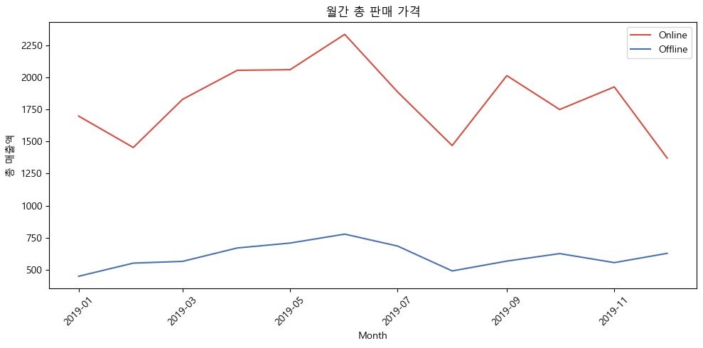
    


```python
plt.figure(figsize=(10, 5))

# Online 데이터
sns.lineplot(x=online_monthly_price.index.to_timestamp(), 
             y=online_monthly_price.values, 
             label='Online', 
             marker='o',
             color="#d64d3f") 

# Offline 데이터
sns.lineplot(x=offline_monthly_price.index.to_timestamp(), 
             y=offline_monthly_price.values, 
             label='Offline', 
             marker='o',
             color="#4672b4")

plt.title("월간 총 판매 가격", fontsize=16, pad=20)
plt.xlabel("판매 시기 (Month)", fontsize=11)
plt.ylabel("총 매출액", fontsize=11)
plt.xticks(rotation=45)
plt.legend(title='채널')
plt.grid(True, linestyle='--', alpha=0.6)
plt.tight_layout()

plt.show()
```


    
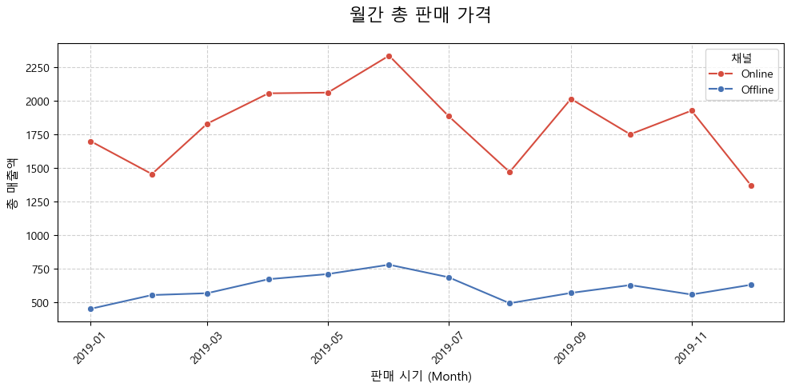
    


```python
# 1. 원하는 출력 순서 정의 (10대부터 Unknown까지)
ordered_index = ['10대', '20대', '30대', '40대', '50대', '60대 이상', 'Unknown']

# 2. 정해진 순서대로 다시 집계 (reindex 사용)
# 이전에 실행한 결과가 섞여 있어도, 이 코드가 순서를 강제로 맞춰추기
age_summary_ordered = df_final['age_segment'].value_counts().reindex(ordered_index)

print("### 연령대별 고객 분포 (정해진 순서대로) ###")
print(age_summary_ordered)
```

    ### 연령대별 고객 분포 (정해진 순서대로) ###
    age_segment
    10대         13751
    20대        332231
    30대        165831
    40대        126767
    50대        136290
    60대 이상      38061
    Unknown    235644
    Name: count, dtype: int64
    


```python
# 1. 연령대별 매출 합계(sum)와 평균(mean) 계산
age_price_analysis = df_final.groupby('age_segment')['price'].agg(['sum', 'mean'])

# 2. 정한 순서대로 정렬 
ordered_index = ['10대', '20대', '30대', '40대', '50대', '60대 이상', 'Unknown']
age_price_analysis = age_price_analysis.loc[ordered_index]


age_price_analysis.columns = ['총 매출액', '평균 객단가']

print("### 연령대별 매출 성과 분석 ###")
age_price_analysis.round(4)
```

    ### 연령대별 매출 성과 분석 ###
    


<div>
<style scoped>
    .dataframe tbody tr th:only-of-type {
        vertical-align: middle;
    }

    .dataframe tbody tr th {
        vertical-align: top;
    }

    .dataframe thead th {
        text-align: right;
    }
</style>
<table border="1" class="dataframe">
  <thead>
    <tr style="text-align: right;">
      <th></th>
      <th>총 매출액</th>
      <th>평균 객단가</th>
    </tr>
    <tr>
      <th>age_segment</th>
      <th></th>
      <th></th>
    </tr>
  </thead>
  <tbody>
    <tr>
      <th>10대</th>
      <td>325.1327</td>
      <td>0.0236</td>
    </tr>
    <tr>
      <th>20대</th>
      <td>8999.9204</td>
      <td>0.0271</td>
    </tr>
    <tr>
      <th>30대</th>
      <td>4638.4555</td>
      <td>0.0280</td>
    </tr>
    <tr>
      <th>40대</th>
      <td>3481.6867</td>
      <td>0.0275</td>
    </tr>
    <tr>
      <th>50대</th>
      <td>3975.9159</td>
      <td>0.0292</td>
    </tr>
    <tr>
      <th>60대 이상</th>
      <td>1157.5371</td>
      <td>0.0304</td>
    </tr>
    <tr>
      <th>Unknown</th>
      <td>6549.8768</td>
      <td>0.0278</td>
    </tr>
  </tbody>
</table>
</div>


```python
plt.figure(figsize=(10, 6))
age_price_analysis['총 매출액'].plot(kind='bar', color='salmon')

plt.title('연령대별 총 매출액 비교')
plt.xlabel('연령대')
plt.ylabel('총 매출액')
plt.xticks(rotation=0) # 글자 똑바로 세우기

plt.show()
```


    

    


```python
# groupby를 이용해 연령대별, 채널별 거래 건수 집계
# unstack()을 하면 채널 번호(1, 2)가 컬럼으로 올라오게됨
channel_counts = df_final.groupby(['age_segment', 'sales_channel_id']).size().unstack(fill_value=0)

channel_counts = channel_counts.rename(columns={1: 'Offline(1)', 2: 'Online(2)'})

ordered_index = ['10대', '20대', '30대', '40대', '50대', '60대 이상', 'Unknown']
channel_counts = channel_counts.loc[ordered_index]

# 4. 비중(%) 계산: 각 연령대 내에서 온/오프라인이 차지하는 비율
channel_perc = channel_counts.div(channel_counts.sum(axis=1), axis=0) * 100

print("### 연령대별 온/오프라인 이용 비중 (%) ###")
channel_perc.round(1)
```

    ### 연령대별 온/오프라인 이용 비중 (%) ###
    


<div>
<style scoped>
    .dataframe tbody tr th:only-of-type {
        vertical-align: middle;
    }

    .dataframe tbody tr th {
        vertical-align: top;
    }

    .dataframe thead th {
        text-align: right;
    }
</style>
<table border="1" class="dataframe">
  <thead>
    <tr style="text-align: right;">
      <th>sales_channel_id</th>
      <th>Offline(1)</th>
      <th>Online(2)</th>
    </tr>
    <tr>
      <th>age_segment</th>
      <th></th>
      <th></th>
    </tr>
  </thead>
  <tbody>
    <tr>
      <th>10대</th>
      <td>41.9</td>
      <td>58.1</td>
    </tr>
    <tr>
      <th>20대</th>
      <td>29.8</td>
      <td>70.2</td>
    </tr>
    <tr>
      <th>30대</th>
      <td>24.9</td>
      <td>75.1</td>
    </tr>
    <tr>
      <th>40대</th>
      <td>33.1</td>
      <td>66.9</td>
    </tr>
    <tr>
      <th>50대</th>
      <td>33.7</td>
      <td>66.3</td>
    </tr>
    <tr>
      <th>60대 이상</th>
      <td>35.8</td>
      <td>64.2</td>
    </tr>
    <tr>
      <th>Unknown</th>
      <td>30.5</td>
      <td>69.5</td>
    </tr>
  </tbody>
</table>
</div>


```python
channel_perc.plot(kind='bar', stacked=True, color=['skyblue', 'salmon'], figsize=(10, 6))

plt.title('연령대별 온/오프라인 비중')
plt.xlabel('연령대')
plt.ylabel('비중 (%)')
plt.legend(title=None, labels=['오프라인(1)', '온라인(2)'])
plt.xticks(rotation=0)
plt.show()
```


    
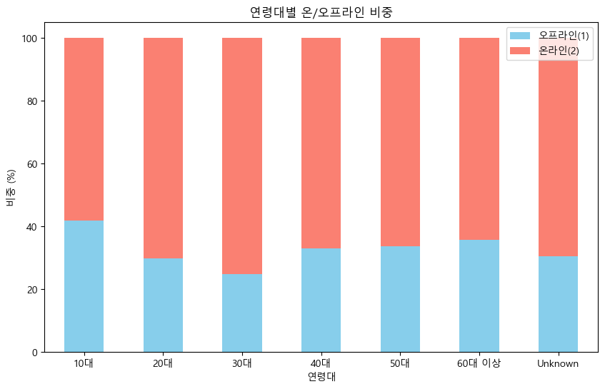
    


```python
##연령대 및 채널별 구매건수
plt.figure(figsize=(7, 4))

sns.countplot(
    data=df_final, 
    x='age_segment', 
    hue='channel', 
    order=['10대', '20대', '30대', '40대', '50대', '60대 이상', 'Unknown'],
    palette='RdBu'
)

plt.title('채널별 연령대 누적 구매 건수', fontsize=16, pad=20)
plt.xlabel('연령대', fontsize=12)
plt.ylabel('누적 구매 건수 (건)', fontsize=12)  #df_merged 행의 개수(=거래 개수)
plt.legend(title='구매 채널')
plt.grid(axis='y', linestyle='--', alpha=0.5)
plt.show()
```


    
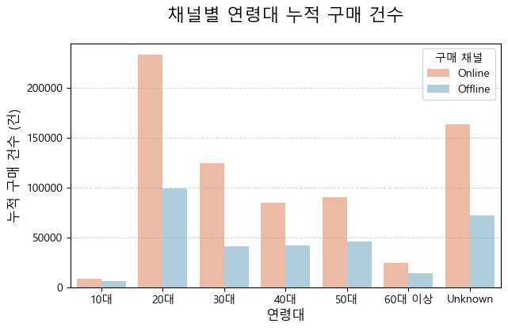
    


```python
## 연령대 및 채널별 누적 매출액
df_sales = df_final.groupby(['age_segment', 'channel'])['price'].sum().reset_index()

plt.figure(figsize=(7, 4))
sns.barplot(
    data=df_sales, 
    x='age_segment', 
    y='price', 
    hue='channel',
    palette='RdBu_r',
    order=['10대', '20대', '30대', '40대', '50대', '60대 이상', 'Unknown']
)

plt.title('채널별 연령대 누적 매출액 비교', fontsize=16)
plt.xlabel('연령대', fontsize=12)
plt.ylabel('총 매출액', fontsize=12)
plt.legend(title='구매 채널', loc='upper right')
plt.grid(axis='y', linestyle='--', alpha=0.5)

plt.show()
```


    
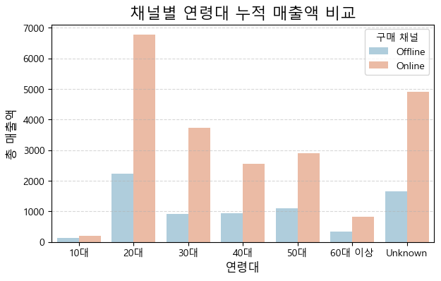
    


```python
## 20대 VS 50대
df_target = df_final[df_final['age_segment'].isin(['20대', '50대'])]

# 20대와 50대를 옆으로 나란히 배치하여 비교
age_vs = sns.catplot(
    data=df_target, 
    x='product_group_name', 
    hue='channel', 
    col='age_segment', 
    col_order=['20대', '50대'], #20대가 먼저 오도록 수정
    kind='count',
    height=5, aspect=1.2,   #그래프 크기~ 데이터 두개 붙인거라(다중그래프) 모양 어케나올지 모르니까 figsize보다 이거 추천. (한 칸의 세로 높이 대 그거 대 가로비율)
    palette='RdBu',
    order=df_target['product_group_name'].value_counts().head(7).index #상위 7개 품목만
)

# 가독성을 위한 설정
age_vs.set_xticklabels(rotation=45)
age_vs.set_axis_labels("품목", "구매 건수")
age_vs.set_titles("{col_name} 인기 상품")
plt.subplots_adjust(top=0.85)   #치솟지마시오
age_vs.fig.suptitle('20대 vs 50대: 채널별 품목 구매 패턴 비교', fontsize=16)

plt.show()
```


    
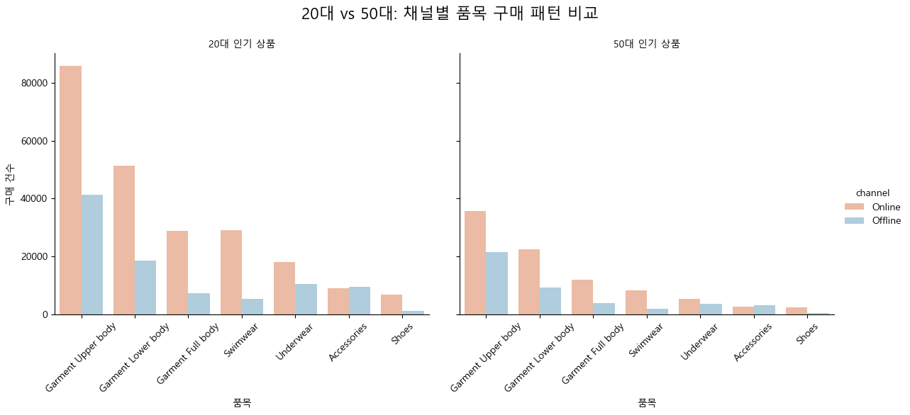
    


```python
###서브 인사이트용 
```


```python
# 카테고리 거래 건수
category_counts = df_final['category_main'].value_counts()

plt.figure(figsize=(6, 6))
plt.pie(
    category_counts, 
    labels=category_counts.index, 
    autopct='%1.1f%%',
    startangle=140, 
    colors=sns.color_palette('pastel'),
)

plt.title('전체 카테고리별 누적 구매 건수 비중', fontsize=15)
plt.show()

#실제 카테고리 별 거래량
print(category_counts)
```


    

    


    category_main
    Ladieswear       677475
    Divided          238788
    Menswear          56394
    Sport             38262
    Baby/Children     37656
    Name: count, dtype: int64
    


```python
# #월별 카테고리 수요

category_data = df_final.groupby(['year_month', 'category_main']).size().unstack(fill_value=0)

# category_data.plot(kind='bar', stacked=True, figsize=(15, 8), colormap='mako',width=0.8)

## 가독성이 안좋아서 다시 재배치하고 인덱스 부여한 후 정렬
category_sequence = category_data.sum().sort_values(ascending=False).index
category_data[category_sequence].plot(
    kind='bar', 
    stacked=True, 
    figsize=(12, 6), 
    colormap='viridis')

plt.title('월별 카테고리 수요', fontsize=16)
plt.ylabel('판매량')
plt.xlabel('판매 시기 (Month)')
plt.show()
```


    
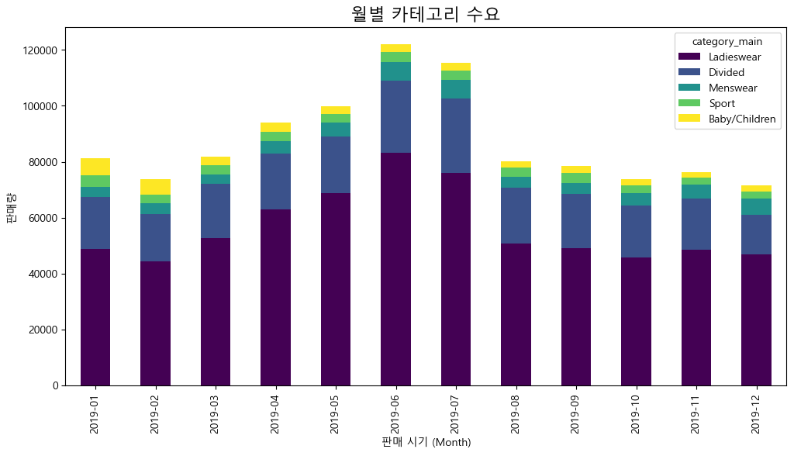
    


```python
#시즌별 카테고리 수요

season_data = df_final.groupby(['year_month', 'product_season']).size().unstack(fill_value=0)
#너도 안되겠다
season_sequence = season_data.sum().sort_values(ascending=False).index
season_data[season_sequence].plot(
    kind='bar', 
    stacked=True, 
    figsize=(12, 6), 
    colormap='crest_r') #로꾸거

plt.title('월별 시즌 상품 수요', fontsize=16)
plt.ylabel('판매량')
plt.xlabel('판매  (Month)')
plt.show()
```


    
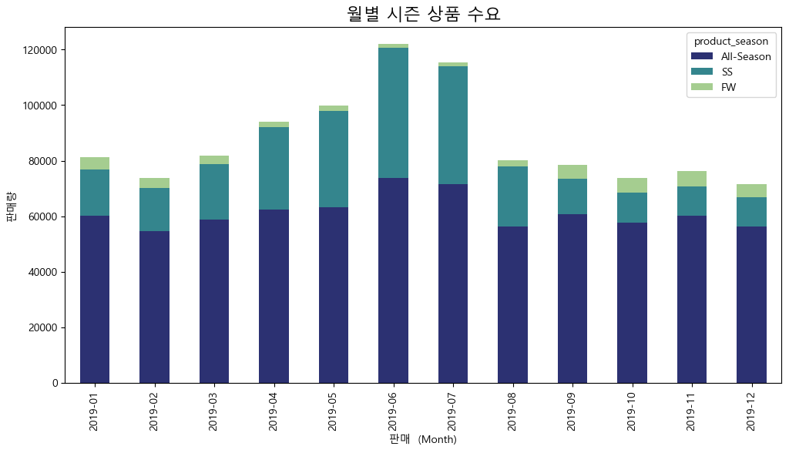
    


```python
# 제품군 색상 톤 비율
tone_counts = df_final['color_tone'].value_counts()
my_tones = ['#2E75B6', '#DDEBF7', '#82B1D1']

plt.figure(figsize=(6, 6))
plt.pie(
    tone_counts, 
    labels=tone_counts.index, 
    autopct='%1.1f%%',
    startangle=140,
    colors = my_tones,
)
plt.title('제품군 색상 톤 비율', fontsize=15)
plt.show()
```


    
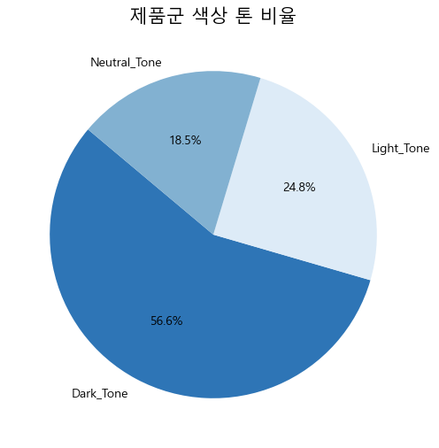
    


```python
#월간 색상별 판매량
tone_trend = df_final.groupby(['year_month', 'color_tone']).size().unstack(fill_value=0)  #가로로 펼치고 없으면 0으로 채워~
### 색을 위 파이차트랑 통일하려면
my_tones = ['#2E75B6', '#DDEBF7', '#82B1D1']

tone_trend.plot(
    kind='bar', #area로 두는 게 낫나? 어.... barh? 일단 line은 안되고 그냥 bar로 하고 팀원들과 상의
    # stacked=True,     #이것도 상의 (area, bar로 결정되면) line이면 marker='o'도 붙이쉐이
    # color=sns.color_palette('vlag'),
    color = my_tones,
    figsize=(10, 5)
)

plt.title('월간 색상별 판매량', fontsize=16)
plt.ylabel('판매량')
plt.xlabel('판매 시기 (Month)')
plt.show()
```


    
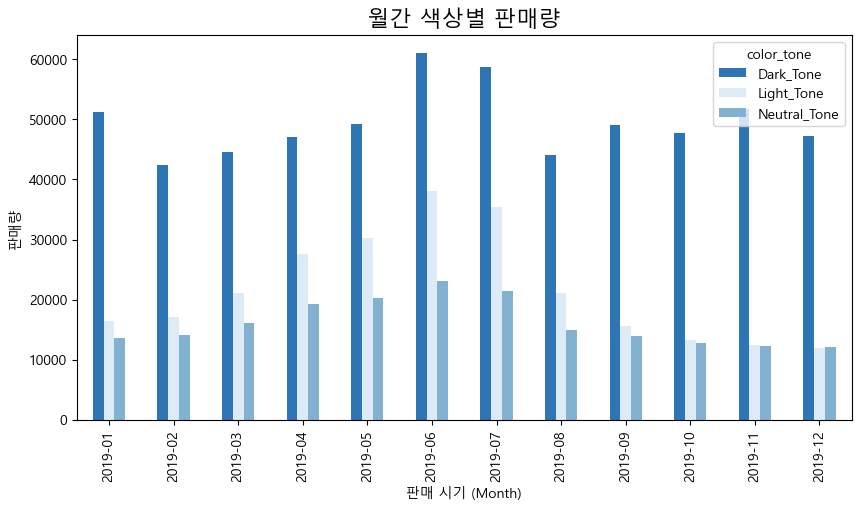
    


```python
# 0. 위에서쓴거(채널별 연령대 누적 매출액)
df_final_sales = df_final.groupby(['age_segment', 'channel'])['price'].sum().reset_index()

# 1. 카테고리 분류해서 따로 뽑기
top_3_categories = df_final.groupby('category_main')['price'].sum().nlargest(3).index.tolist()    #젤큰거3개뽑기
df_final_cat_top3 = df_final[df_final['category_main'].isin(top_3_categories)]
#OR
#my_target_categories = ['Ladieswear', 'Divided', 'Menswear']
#df_final_cat_target = df_final[df_final['category_main'].isin(my_target_categories)] 해도 됨 

# 2. 합쳐서 나눠담기
df_final_cat_plot = df_final_cat_top3.groupby(['age_segment', 'category_main'])['price'].sum().reset_index()

plt.figure(figsize=(14, 8))

# 연령대별/채널별 매출
sns.barplot(
    data=df_final_sales, 
    x='age_segment', 
    y='price', 
    hue='channel',
    palette='RdBu_r',
    order=['10대', '20대', '30대', '40대', '50대', '60대 이상', 'Unknown'],
    alpha=0.8
)

# 라인차트(카테고리)
sns.lineplot(
    data=df_final_cat_plot,
    x='age_segment',
    y='price',
    hue='category_main',
    hue_order=top_3_categories,
    marker='o',
    markersize=10,
    linewidth=4,
    palette='magma'
)

plt.title('연령대별 채널 매출 및 주요 TOP 3 카테고리 추이', fontsize=16)
plt.xlabel('연령대', fontsize=12)
plt.ylabel('총 매출액', fontsize=12)
plt.legend(title='매출 항목', bbox_to_anchor=(1.05, 1), loc='upper left')
plt.tight_layout()
plt.show()

```


    
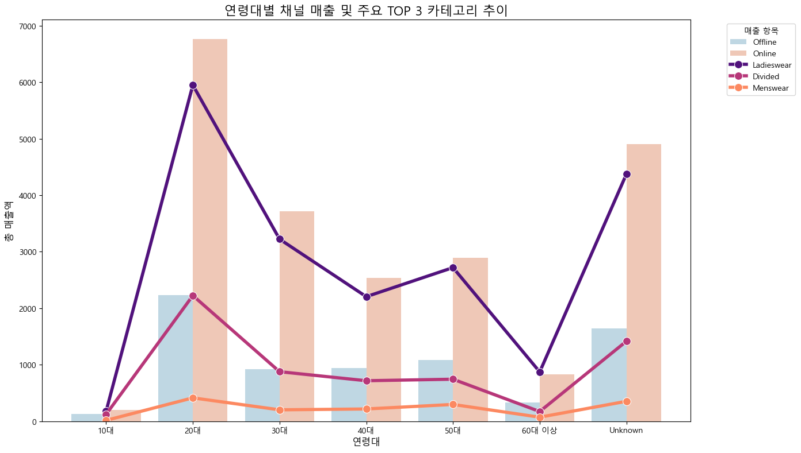
    


```python
!python -m jupyter nbconvert --to markdown "jinjja_jinjja_final.ipynb"
```
