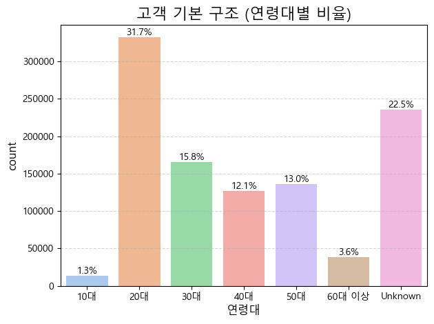
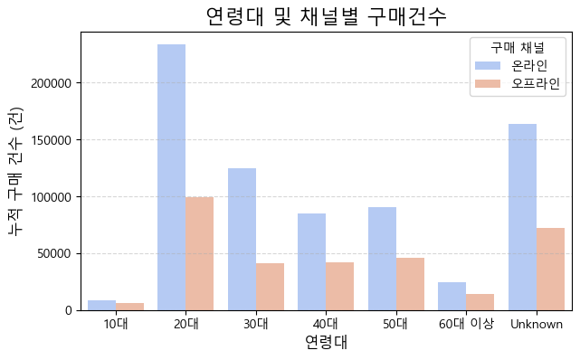

# 1. `customers_hm` 테이블의 연령대 시각화

> 20대의 비율이 약 39%로 가장 높게 나오며, 10대의 비율이 가장 낮음을 볼 수 있다.

# 2. `customers_hm`과 `transactions_hnm` 조인 후 연령대 시각화

> `customers_hm` 테이블에 존재하지 않고, `transactions_hnm` 테이블에 구매 내역만 존재하는 데이터를 `Unknown` 처리하여 시각화해본 결과 약 20% 이상의 비율을 가진 것을 확인하였다.

# 3. 연령대 및 채널별 구매건수

> 모든 연령대에서 온라인 구매율이 높게 나왔으며, 20대의 구매력은 다른 연령대에 비해 매우 높음을 볼 수 있다.

# 4. 연령대별 카테고리 실구매수

> 모든 연령대에서 Ladieswear 카테고리의 구매가 가장 많이 이뤄졌으며, 다음으로는 Divided 카테고리의 구매가 많음을 볼 수 있다.